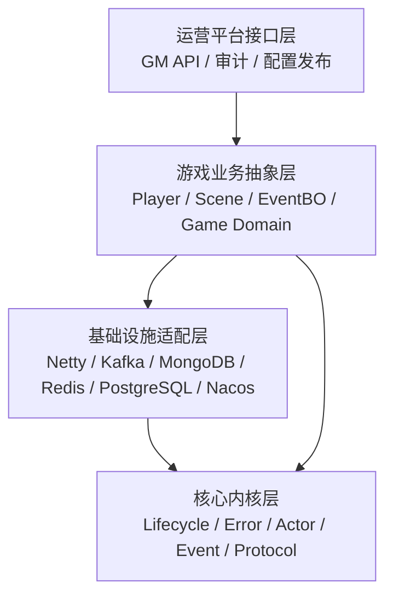
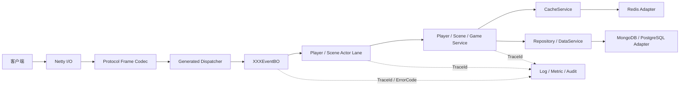

# zeroServer

[](https://github.com/yixunfei/zero-server/actions/workflows/ci.yml)
[](https://openjdk.org/projects/jdk/21/)
[](LICENSE)
[](CHANGELOG.md)

zeroServer 是一个面向实时在线游戏的通用 Java 21 服务端框架。它以“游戏专用运行时内核 + Starter/Adapter 生态”为核心：用 Actor/执行域约束状态修改，用事件和协议代码生成提升业务开发速度，用 Netty、Kafka、MongoDB、Redis、PostgreSQL、Nacos Adapter 连接真实基础设施，同时让本地单进程原型和分布式部署尽量共享业务抽象。

项目采用 [MIT License](LICENSE)，可以用于开源或商业项目。

> [!IMPORTANT]
> 当前版本是 `0.1.0-SNAPSHOT` 开发预览，不是生产就绪发行版。仓库已经具备可运行的本地闭环、真实 Adapter、显式生产装配最小实现和可复现微基准，但尚未提供完整 TLS/WAF/DDoS 网关、GM RBAC/审批、生产日志落地、Prometheus HTTP Endpoint、容量、长稳、p99 或 SLA 证明。请先阅读[当前能力边界](#当前能力与限制)和[生产使用注意事项](#生产使用注意事项)。

## 为什么是 zeroServer

游戏服务器的难点不只是“收一个包、改一行数据”：连接生命周期、协议兼容、线程归属、玩家/场景状态一致性、跨服调用、缓存与落库、运营审计和故障降级会在项目扩大后彼此耦合。zeroServer 尝试把这些承重结构变成可组合且可验证的框架能力。

- **业务先行**：从 `.si` 协议生成 DTO、Codec、EventBO、默认实现、Dispatcher、ErrorCode、测试和多语言客户端代码。
- **状态有主**：玩家在线状态绑定 player lane，场景状态绑定 scene lane；跨 Actor 修改通过消息完成。
- **本地简单**：默认 Starter 不需要 Docker 或外部中间件，适合原型、教学、测试和单进程服务。
- **生产显式**：真实 Kafka、MongoDB、Redis、PostgreSQL、Nacos 只通过 Production Starter 显式启用；缺配置、健康失败或预算耗尽时 fail-fast，不静默退回本地实现。
- **核心低依赖**：`zero-core`、`zero-event`、`zero-actor`、`zero-protocol` 不依赖具体中间件；中立 `zero-runtime` 只依赖 `zero-core`。
- **性能可验证**：关键路径关注分配、锁、队列、复制、阻塞和背压；性能结论必须附工作负载、环境与复现方法。
- **运营可追踪**：TraceId、统一 ErrorCode、结构化日志、敏感字段安全门、低基数指标、GM dry-run 和审计归因贯穿运行时。

## 三分钟快速开始

### 环境

- JDK 21
- Maven 3.9+
- Git

克隆并检查环境：

```bash
git clone https://github.com/yixunfei/zero-server.git
cd zero-server
java scripts/ZeroLocalDoctor.java
```

安装当前 SNAPSHOT 并创建一个本地 RPG/场景同步原型：

```bash
java scripts/RunLocalPrototype.java \
  --fromKeywords "rpg scene sync" \
  --projectName my-game \
  --packageName group.example.mygame \
  --force
```

PowerShell 使用反引号续行：

```powershell
java scripts/RunLocalPrototype.java `
  --fromKeywords "rpg scene sync" `
  --projectName my-game `
  --packageName group.example.mygame `
  --force
```

该命令会：

1. 检查 Java 21、Maven 3.9+、Git 和仓库根目录。
2. 安装当前 `0.1.0-SNAPSHOT` 工件。
3. 按关键词选择脚手架。
4. 在 `target/generated/my-game` 生成独立 Maven 工程。
5. 解析 `.si` 并生成 Java DTO/Codec/EventBO/Dispatcher。
6. 执行生成工程测试和本地入口。
7. 提示从 `BUSINESS_GUIDE.md` 的 “First Business Change” 开始业务开发。

默认路径不启动 Docker、不打开公网端口、不连接外部中间件，并输出 `externalMiddleware=false`、`productionReady=false`。

只想运行仓库内示例：

```bash
mvn -B -ntp -DskipTests install
mvn -B -ntp -f examples/rpg-minimal/pom.xml test exec:java
```

完整说明见[快速上手](docs/quickstart.zh-CN.md)。

## 核心能力

| 领域 | 当前能力 |
| --- | --- |
| 生命周期与错误 | 统一生命周期状态、逆序回滚、配置快照、SPI、ErrorCode 分类、异常基类 |
| 事件 | 本地事件总线、优先级、拦截器、显式重试、死信、TraceId 上下文 |
| Actor | lane key、同 lane 串行、跨 lane 并行、外部执行器调度、远程 Actor gateway SPI |
| 协议 | Zero Binary Protocol、Frame Codec、Reader/Writer、注册表、nullable/集合编码 |
| 代码生成 | `.si` → Java/C#/TypeScript/GDScript、DTO/Codec/EventBO/Dispatcher/ErrorCode/测试/文档 |
| 游戏抽象 | 请求上下文、玩家登录/加载/查询、场景进入/移动/离开/快照 |
| 网络 | Netty TCP/UDP/HTTP、粘包拆包、Frame 桥接、生产 TCP 生命周期最小实现 |
| RPC | request/response、oneway、broadcast 抽象、接口代理、本地传输、Kafka Adapter |
| 服务发现 | 本地注册表、Nacos Adapter、实例查询/订阅、RPC metadata 映射 |
| 数据 | Repository/DataService、对象映射、版本实体、envelope、MongoDB/Redis/PostgreSQL Adapter |
| 缓存 | L1/L2、cache-aside、single-flight、负缓存、版本写入、Redis L2、统计与健康状态 |
| 配置与定时 | CSV 原子热重载、失败保旧、WatchService；受管 once/fixed-delay/fixed-rate 任务 |
| GM | 命令 DSL、注册、dry-run、执行、提交状态、ErrorCode 和审计归因 |
| 可观测性 | 结构化日志、安全门、脱敏、Prometheus 文本、Grafana JSON、告警规则、系统指标 |
| 装配 | 无 Docker 本地 Starter；真实 Adapter 显式 Production Starter；安全装配报告 |
| 工具 | 环境 Doctor、架构守卫、项目生成、脚手架检查/运行/批量验证、JMH 模块 |

## 设计理念

### 游戏专用运行时内核 + Starter/Adapter

核心内核只定义稳定、低依赖的运行时语义。Starter 决定一组组件如何被装配和管理，Adapter 把中立接口映射到具体基础设施。



关键约束：

- `zero-core` 禁止依赖任何具体中间件。
- `zero-event`、`zero-actor`、`zero-protocol` 只向核心依赖。
- 真实 Adapter 位于依赖图上层，通过接口接入。
- Starter 可以依赖组件，组件不能反向依赖 Starter。
- benchmark 是最上层叶子，运行时模块不能依赖 benchmark。

### 单一状态所有者

业务共享锁很容易随着玩法增长演变为不可推理的锁顺序。zeroServer 用 lane 表达状态所有权：

- 玩家在线状态默认由 `player:<id>` lane 修改。
- 场景实体状态默认由 `scene:<id>` lane 修改。
- 同一 lane 的消息顺序执行。
- 跨 lane 只传消息或不可变快照，不直接修改对方对象。
- 远程路由不会改变所有权规则：消息到达目标进程后仍投递到本地 Actor scheduler。

### 事件与协议驱动业务

典型请求链路：



业务程序员通常修改生成的 `XXXEventBOImp` 或独立业务实现，而不是手写网络解析、线程切换和协议路由。

### 本地与生产共享抽象

本地模式使用内存事件总线、Actor、RPC、Repository、Cache、日志和监控实现；生产模式替换为真实 Adapter，但业务仍依赖相同的事件、Actor、Repository、Cache 和 RPC 接口。

```text
本地原型
  -> 单进程模块化服务
  -> 按玩家/场景拆分 Actor lane
  -> 显式接入 Redis/MongoDB/PostgreSQL
  -> Kafka RPC + Nacos 服务发现
  -> 按服务边界拆分多进程
  -> 独立网关、运营 API、监控与数据链路
```

## 模块结构

### 构建与核心内核

| 模块 | 职责 | 主要入口/注意事项 |
| --- | --- | --- |
| `zero-parent` | Java 21、插件、测试和质量门禁 | Parent POM；不放运行时代码 |
| `zero-bom` | 统一 zeroServer 工件版本 | 供业务工程 import；不放业务代码 |
| `zero-core` | 生命周期、配置、SPI、错误、受管定时任务契约 | `Lifecycle`、`ZeroConfig`、`ErrorCode`、`ManagedScheduler`；禁止中间件依赖 |
| `zero-event` | 事件模型、总线、处理器、拦截器、死信 | `EventBus`、`InMemoryEventBus`；禁止直接访问具体存储 |
| `zero-protocol` | 协议定义、Buffer、Codec、Frame、注册表 | `ZeroReader`、`ZeroWriter`、`ZeroBinaryFrameCodec`；禁止依赖 Netty |
| `zero-codegen` | DSL 和多语言生成 | `ProtocolCodegenCli`、`ProtocolCodegenRunner`；不进入业务运行时热路径 |
| `zero-actor` | lane、调度、上下文和远程网关 SPI | `ActorScheduler`、`LocalActorScheduler`、`RemoteActorGateway`；handler 禁止阻塞远程 IO |

### 游戏业务抽象

| 模块 | 职责 | 主要入口/注意事项 |
| --- | --- | --- |
| `zero-game` | 游戏执行域、请求上下文、Actor 投递 | `GameExecutionDomain`、`GameRequestContext`；不写具体玩法规则 |
| `zero-player` | 登录、会话、加载、查询和在线状态 | `PlayerService`、`LocalPlayerService`；状态通过 player lane 修改 |
| `zero-scene` | 进场景、移动、离开、实体状态和快照 | `SceneService`、`LocalSceneService`；状态通过 scene lane 修改 |
| `zero-logic` | 本地业务形态和端到端逻辑夹具 | 示例/测试承载，不替代正式游戏业务模块 |
| `zero-gm` | GM DSL、dry-run、执行和审计 | 不内置完整 Web 后台；不能绕过 Actor 修改状态 |
| `zero-hot-update` | CSV 配置加载、校验和原子替换 | 当前是本地单进程配置热更；核心代码不热更 |

### 网络、RPC、数据与运维

| 模块 | 职责 | 主要入口/注意事项 |
| --- | --- | --- |
| `zero-net` | Netty TCP/UDP/HTTP、连接、Frame 桥、生产连接状态 | IO 线程禁止阻塞业务；KCP/WebSocket 等仍是扩展边界 |
| `zero-rpc-common` | 业务双方共享的 RPC 注解、模式和结果 | 不依赖具体 transport |
| `zero-rpc` | RPC 路由、接口代理、传输 SPI、pending 抽象 | 优先异步；同步默认超时，业务仍需幂等 |
| `zero-rpc-kafka` | Kafka producer/consumer、reply、pending、超时轮 | 不向业务暴露 Kafka client；错误和配置文本必须脱敏 |
| `zero-data` | Repository/DataService、mapping、envelope、持久化管理 | 不依赖具体数据库或 Actor |
| `zero-data-mongo` | MongoDB envelope store 和健康检查 | 主要承载游戏业务主数据；URI/认证不得回显 |
| `zero-data-redis` | Redis 数据、追加日志、L2 Cache | 数据 key 由策略生成；业务禁止手拼 key |
| `zero-data-postgresql` | PostgreSQL envelope store 和健康检查 | 适合平台、账号、后台和关系数据 |
| `zero-cache` | L1/L2、load、single-flight、负缓存、统计 | 必须处理击穿、穿透、失效、版本和降级 |
| `zero-discovery-nacos` | 本地/Nacos 服务发现、订阅和 RPC metadata | Nacos 是可选 Adapter，不能污染 RPC/Core |
| `zero-log` | 统一日志、Appender/Sink、安全门和脱敏 | 业务只能接收 `LogAppender`，不能绕过 Pipeline |
| `zero-monitor` | 指标、Prometheus、Grafana、告警和系统探针 | 禁止 playerId/traceId/IP 等高基数标签 |
| `zero-runtime` | 显式组件选择、typed config、依赖图、生命周期事务、安全诊断与共享能力模型 | 1B/1C 已实现；Local Starter、生成器和模板已迁移；真实 Adapter provider 留在 1D；不扫描 classpath |
| `zero-server-starter` | 本地默认装配、Builder、生命周期和 demo | 默认不连接外部组件，不扫描 classpath 自动启用 Adapter |
| `zero-server-starter-production` | 真实 Adapter 显式装配、健康、预算和回滚 | single-use runtime；fail-fast；当前仍非 production ready |
| `zero-benchmarks` | opt-in JMH workload | 仅 `-Pbenchmarks` 加入 Reactor；不设 CI 性能阈值 |

更细的依赖方向、入口和常见修改位置见[模块图](docs/module-map.md)。

## 线程模型

| 执行域 | 应做 | 禁止 |
| --- | --- | --- |
| Netty IO | Frame 解码、轻量校验、入站预算、投递 | 数据库、阻塞鉴权、复杂业务、等待 Future |
| Actor logic | 玩家/场景状态变更、有序业务逻辑 | 不可控远程 IO、跨 lane 直接写对象 |
| Remote IO | Kafka、数据库、Redis、Nacos、远程鉴权 | 回调直接修改 Actor 状态 |
| Scheduler | 定时触发、超时、取消和限流 | 无界任务、不可取消后台循环 |
| Background/virtual thread | 低频 GM、维护、边缘远程 IO | 替代高频 Actor tick 或绕过执行器管理 |

远程 IO 完成后应把结果作为消息投回所属 Actor；不要在 Actor handler 中 `join()` 不可控 Future。完整规则见[线程模型](docs/threading-model.zh-CN.md)。

## 协议 DSL 与代码生成

`.si` 是推荐协议入口。一个协议方法可以生成：

- Java DTO、payload codec、协议常量和定义。
- `XXXEventBO` 与可选 `XXXEventBOImp`。
- Generated Dispatcher、ErrorCode 和 JUnit 模板。
- C#、TypeScript、GDScript 客户端 DTO/Codec。
- Markdown 协议文档。

典型流程：

```text
game.si + protoId.txt
  -> DSL parser / validator
  -> Java DTO + Codec + EventBO + Dispatcher
  -> 客户端 C# / TypeScript / GDScript
  -> 业务实现 XXXEventBOImp
  -> Actor lane
```

协议 ID、字段顺序、nullable 编码和线格式属于兼容契约。新增字段应优先尾部追加；删除、重排、改类型或更改协议 ID 前必须设计迁移。详见[协议 DSL](docs/protocol-dsl.zh-CN.md)和 `zero-codegen/docs/user-guide.zh-CN.md`。

## 不同游戏场景如何选择

| 场景 | 推荐模板 | 关键模块 | 首要风险 |
| --- | --- | --- | --- |
| RPG/回合/卡牌原型 | `local` | starter、player、scene、protocol、actor | 先保持单进程，避免过早引入分布式复杂度 |
| 房间/匹配 | `room` | actor、event、protocol、net、game | 房间所有权、断线重连、准备/结算幂等 |
| RPG 场景状态同步 | `scene-sync` | scene、player、actor、net、protocol | AOI、广播扇出、移动频率和快照一致性 |
| 帧同步 | `frame-sync` | actor、protocol、net、game | 帧序、输入窗口、确定性、迟到输入和回放 |
| AI/NPC 世界运转 | `npc-tick` | actor、scheduler、scene、event | tick 分片、预算、降级和远程 IO 隔离 |
| 排行榜/赛季 | `ranking-season` | cache、Redis Adapter、data、scheduler | 分片 key、赛季切换、并发更新和结算幂等 |
| 开放世界/分片 | `world-shard` | scene、actor、rpc、discovery、data | 所有权迁移、跨服路由、双写和故障恢复 |

查看模板：

```bash
java scripts/NewLocalGame.java --listTemplates
java scripts/NewLocalGame.java --recommend "open world shard"
```

生成指定模板：

```bash
java scripts/NewLocalGame.java \
  --template world-shard \
  --projectName my-world \
  --packageName group.example.myworld \
  --outputDir target/my-world \
  --force
java scripts/RunLocalScaffold.java --projectDir target/my-world
```

这些模板是 local/prototype 起点，不是已经冻结的生产玩法模块。房间、AOI、帧同步、NPC、排行榜和分片迁移的详细契约位于 `docs/*-minimum-contract.zh-CN.md`。

## 示例

| 示例 | 说明 | 命令 |
| --- | --- | --- |
| `examples/rpg-minimal` | 登录、玩家加载、进场景、移动、GM 查询和协议生成 | `mvn -f examples/rpg-minimal/pom.xml test exec:java` |
| `examples/rpg-tcp-generated` | 真实 TCP、Frame、generated dispatcher、BO 和响应 | `mvn -f examples/rpg-tcp-generated/pom.xml test exec:java` |
| `examples/config-hot-reload-local` | CSV 初始发布、合法替换、非法候选失败保旧 | `mvn -f examples/config-hot-reload-local/pom.xml test exec:java` |
| `examples/managed-scheduler-local` | once/fixed-delay/fixed-rate、取消、失败策略、Actor/IO 投递 | `mvn -f examples/managed-scheduler-local/pom.xml test exec:java` |
| `examples/observability-local` | 结构化日志、敏感字段拒绝、脱敏、指标标签安全门 | `mvn -f examples/observability-local/pom.xml test exec:java` |

独立示例运行前先在根目录执行：

```bash
mvn -B -ntp -DskipTests install
```

## 构建与验证

克隆后或日常开发先运行本地关键路径验收：

```bash
java scripts/ZeroStage0Acceptance.java --level quick
```

提交前运行完整阶段 0 验收；它串联环境、架构、Maven 门禁、五类独立示例和七类脚手架，并将日志限制在 `target/stage0-acceptance/`：

```bash
java scripts/ZeroStage0Acceptance.java --level full
```

完整检查映射、超时、输出和安全边界见[阶段 0 开箱即用验收](docs/local-stage0-acceptance.zh-CN.md)。分层命令仍可独立执行：

默认单元测试：

```bash
mvn -B -ntp test
```

Checkstyle、PMD、SpotBugs 和 JaCoCo：

```bash
mvn -B -ntp -Pquality verify
```

不需要外部组件的集成测试：

```bash
mvn -B -ntp -Pintegration-tests verify
```

真实外部组件测试必须显式启用并自行提供安全配置：

```bash
mvn -B -ntp -Pexternal-tests verify
```

验证所有脚手架：

```bash
mvn -B -ntp -DskipTests install
java scripts/VerifyLocalScaffolds.java --outputDir target/scaffold-verify
```

架构依赖守卫：

```bash
java scripts/ZeroArchitectureGuard.java
```

JMH：

```bash
mvn -B -ntp -Pbenchmarks -pl :zero-benchmarks -am -DskipTests package
java -jar zero-benchmarks/target/benchmarks.jar
```

## 性能对比

2026-08-06 在 AMD Ryzen 9 7950X、Java 21.0.4、Windows 11 上复跑同一 DTO 的 Zero Binary Protocol、Protobuf 4.35.0 和 FlatBuffers 25.2.10：

| Codec | 平均体积 bytes | 编码 ns/op | 完整解码 ns/op | 热字段读取 ns/op | 往返 ns/op |
| --- | ---: | ---: | ---: | ---: | ---: |
| zero-proto | 437.46 | 353.47 | 296.71 | 12.18 | 669.83 |
| protobuf | 497.63 | 885.53 | 866.55 | 825.26 | 1905.95 |
| flatbuffers | 880.74 | 865.07 | 610.47 | 5.94 | 1495.04 |

本 workload 中 zero-proto 的体积、编码、完整解码和往返最低；FlatBuffers 的三个热字段随机读取最快。该测试是手写 micro benchmark，不是生产吞吐结论，也不能代表三种协议的所有使用方式。

JMH 还测量了日志字段、指标标签、脱敏和生产网络 observer：0/8/32 个日志扩展字段约为 262/1837/6828 ns/op，0/4/8 个指标标签约为 40.0/219/402 ns/op，脱敏未命中/命中约为 338/478 ns/op。结果说明字段预算和低基数标签约束具有实际性能意义，但单机单线程 micro benchmark 不等于容量、p99 或 SLA。

完整环境、参数、第二轮结果、相对倍率、JMH 置信区间和复现步骤见[性能设计与基准](docs/performance.zh-CN.md)。

## 部署形态

### 本地单进程

`zero-server-starter` 默认装配：

- 内存事件总线和死信。
- 本地 Actor scheduler。
- 内存协议注册表和 RPC transport。
- 本地 Repository、L1/分层 Cache。
- 安全日志 Pipeline 和内存指标运行时。
- 由 Starter 管理的 logic、actor、remote IO、background 执行器。

它不因 classpath 出现 Adapter 就自动连接外部服务。业务通过 `LocalRuntime.builder()` 创建显式装配器，并用 typed capability 与 provider ID 替换实现；可在创建资源前调用 `diagnose()` 检查组件图。

### 显式生产 Adapter 装配

业务项目显式依赖 `zero-server-starter-production`，通过 `ZeroProductionRuntimeFactory.productionBuilder(...)` 选择 Adapter。常用选择器：

```properties
zero.adapter.rpc.kafka.enabled=false
zero.adapter.data.mongo.enabled=false
zero.adapter.data.redis.enabled=false
zero.adapter.cache.redis.enabled=false
zero.adapter.data.postgresql.enabled=false
zero.discovery.mode=local
zero.net.lifecycle.enabled=false

zero.adapter.startup-budget-millis=60000
zero.adapter.startup-timeout-millis=10000
```

启用某 Adapter 后必须提供对应隔离配置。例如 Kafka 使用 `zero.rpc.kafka.bootstrap-servers` 或 `ZERO_KAFKA_BOOTSTRAP_SERVERS`，MongoDB 使用 `ZERO_MONGO_URI`/`ZERO_MONGO_DATABASE`，Redis 使用 `ZERO_REDIS_URI`，PostgreSQL 使用 `ZERO_POSTGRESQL_URL`/`ZERO_POSTGRES_USER`/`ZERO_POSTGRES_PASSWORD`，Nacos 使用 `ZERO_NACOS_SERVER_ADDR` 等。

`ZeroProductionRuntime` 直接实现 `GameRuntime`。业务从 `ProductionRuntimeCapabilities` 选择中立接口，通过 `require(...)`、`optional(...)` 或 `requireAll(...)` 访问 RPC、data、cache、discovery、resolver 和 network lifecycle；驱动 client 不作为公共能力暴露。Adapter 状态使用 `productionReport()`，标准组件图与资源状态使用 `report()`。启用 production network 时还必须对 builder 显式提供 `networkPolicy(...)` 和不会内联 remote IO 的 `ZeroRuntimeExecutors`。

不要把真实值写入仓库。生产装配报告和异常只显示配置键、来源、Adapter、阶段、状态和 ErrorCode，不回显 URI、host、database、topic、namespace、group、账号、密码或第三方异常原文。

详细键、启动预算、健康检查和回滚语义见[Production Adapter fail-fast 契约](docs/production-adapter-failfast-contract.zh-CN.md)。

### 基础设施职责建议

| 组件 | 建议职责 |
| --- | --- |
| PostgreSQL | 平台、账号、渠道、后台、关系型运营数据 |
| MongoDB | 游戏业务主数据和对象 envelope |
| Redis | L2 Cache、排行榜、短期状态、追加式过渡存储 |
| Kafka | 跨服 RPC、异步事件和日志/数据链路扩展 |
| Nacos | 可选服务发现和实例 metadata |
| Prometheus/Grafana | 指标采集、看板和告警规则 |

## 可观测性与安全

- TraceId 从入口传到事件、Actor、RPC、数据、日志和审计；不能作为 Prometheus label。
- 业务、observer 和 GM 只接收 `LogAppender`；顶层把 terminal `LogSink` 包装进唯一 `LogPipeline`。
- Pipeline 在 processor 前后执行字段预算和敏感字段安全门。
- 错误日志和非成功业务结果绑定真实 ErrorCode。
- 指标定义显式声明有序 label names；禁止玩家 ID、连接 ID、完整 IP、房间/场景 ID 和任意原始业务值作为标签。
- GM 审计在命令构造前建立安全归因，不记录 raw command、原参数、原异常信息或真实身份明文。

详见[日志与可观测性](docs/logging-observability.zh-CN.md)、[可观测性运行时](docs/observability-runtime.zh-CN.md)和[安全策略](SECURITY.md)。

## 生产使用注意事项

在真实项目上线前至少完成：

- 独立公网网关、TLS、WAF/DDoS、身份认证和密钥管理。
- 根据业务协议做兼容治理、限流、输入预算、防重放和灰度。
- 为 Actor lane、队列、pending、Scheduler、Cache 和连接入站设置可观测容量边界。
- 为远程 IO 配置超时、重试边界、熔断、降级和故障演练；业务操作具备幂等性。
- 对玩家/场景数据设计脏数据、异步落库、失败保留、版本冲突和恢复策略。
- 实现完整 GM RBAC、IP 白名单、审批、双人复核和不可篡改审计。
- 接入生产文件/Kafka 日志 Sink、Prometheus HTTP Endpoint 和真实告警通道。
- 完成真实 payload、并发连接、p95/p99、GC、内存、CPU、队列水位、容量和长稳压测。
- 对 Kafka、MongoDB、Redis、PostgreSQL、Nacos 做认证、网络隔离、备份、升级和灾备设计。
- 固化部署、滚动升级、回滚、数据迁移、应急和安全响应流程。

## 当前能力与限制

| 状态 | 含义 | 当前内容 |
| --- | --- | --- |
| 可运行 | 有实现和自动测试，可用于本地开发 | 核心生命周期、事件、Actor、协议、代码生成、本地 Starter、RPG 闭环 |
| 最小实现 | 语义和 focused tests 已建立，但范围有限 | 生产 TCP 生命周期、Production Adapter fail-fast、可观测性安全门 |
| 原型 | 可生成或本地运行，正式契约尚未冻结 | Player/Scene 高级能力、房间、AOI、帧同步、NPC、排行、世界分片 |
| 设计边界 | 有文档或 SPI，没有完整生产实现 | CGLIB/ClassLoader 热更、完整 GM 安全、生产日志/监控 Endpoint |
| 未证明 | 不应对外承诺 | 生产容量、长稳、p99、SLA、多机故障恢复和完整安全网关 |

详细能力与缺口见[能力矩阵](docs/capability-matrix.zh-CN.md)。

## 演进与扩展

### 从原型到分布式

1. 使用本地 Starter 和模板验证玩法主循环。
2. 固定协议、Actor 所有权、ErrorCode、日志和指标。
3. 将远程 IO 从 Actor handler 中抽离，建立超时与降级。
4. 通过 Repository/Cache 接入 MongoDB、Redis 或 PostgreSQL。
5. 引入 Production Starter，逐个显式启用并验证 Adapter。
6. 用 Kafka RPC 和 Nacos 拆分跨服或独立服务。
7. 增加网关、运营 API、审计、监控、压测和故障演练。
8. 只有在业务边界稳定后再做微服务拆分，避免把单体内部耦合变成网络耦合。

### 新增 Adapter

1. 在中立模块定义最小 SPI，不把第三方类型暴露给业务。
2. 创建独立 `zero-*-<implementation>` 模块实现 SPI。
3. Adapter 管理客户端生命周期、超时、健康和资源关闭。
4. 配置和异常文本脱敏，禁止把第三方 Throwable 图直接向上暴露。
5. 在 Production Starter 增加显式 selector 和装配槽位。
6. 添加内存/单元测试、真实 external tests、失败回滚和文档。
7. 若依赖方向改变，同步更新[模块图](docs/module-map.md)。

### 新增业务能力

优先新增协议方法、业务 EventBO 和独立业务服务，而不是继续扩大一个万能 handler。让网络、Actor、Repository、Cache 和日志依赖通过接口注入，保持单一职责和可替换性。

## 文档导航

### 开始使用

- [快速上手](docs/quickstart.zh-CN.md)
- [产品设计](docs/product-design.zh-CN.md)
- [总体架构](docs/architecture.zh-CN.md)
- [模块图](docs/module-map.md)
- [能力矩阵](docs/capability-matrix.zh-CN.md)
- [阶段 0 开箱即用验收](docs/local-stage0-acceptance.zh-CN.md)

### 核心模型

- [模块化运行时装配设计（阶段 1B/1C 实现与 1D 边界）](docs/modular-runtime-assembly.zh-CN.md)
- [事件模型](docs/event-model.zh-CN.md)
- [线程模型](docs/threading-model.zh-CN.md)
- [协议 DSL](docs/protocol-dsl.zh-CN.md)
- [网络完整链路](docs/net-full-flow.zh-CN.md)
- [RPC 设计](docs/rpc.zh-CN.md)
- [数据与缓存](docs/data-cache.zh-CN.md)

### 运行与运维

- [Production Adapter fail-fast](docs/production-adapter-failfast-contract.zh-CN.md)
- [生产网络生命周期](docs/production-network-lifecycle-contract.zh-CN.md)
- [日志与可观测性](docs/logging-observability.zh-CN.md)
- [可观测性运行时](docs/observability-runtime.zh-CN.md)
- [GM 与后台 API](docs/gm-admin.zh-CN.md)
- [热更方案](docs/hot-update.zh-CN.md)
- [性能设计与基准](docs/performance.zh-CN.md)

### 场景与工具

- [房间](docs/room-component-minimum-contract.zh-CN.md)
- [AOI/状态同步](docs/aoi-state-sync-minimum-contract.zh-CN.md)
- [帧同步](docs/frame-sync-minimum-contract.zh-CN.md)
- [NPC Tick](docs/npc-tick-minimum-contract.zh-CN.md)
- [排行榜/赛季](docs/ranking-season-minimum-contract.zh-CN.md)
- [开放世界/分片](docs/world-shard-minimum-contract.zh-CN.md)
- [脚手架模板](docs/scaffold-templates.zh-CN.md)
- [CSV 配置热重载](docs/csv-config-hot-reload.zh-CN.md)
- [受管定时任务](docs/managed-scheduler.zh-CN.md)

## 贡献

欢迎提交 Bug、功能建议、文档、测试、Adapter 和性能证据。公共 API、协议、线程、存储、权限、热更或模块依赖方向变更，请先创建 Design Proposal。

提交前请阅读 [CONTRIBUTING.md](CONTRIBUTING.md) 和 [CODE_OF_CONDUCT.md](CODE_OF_CONDUCT.md)，安全问题通过 [Private Vulnerability Reporting](https://github.com/yixunfei/zero-server/security/advisories/new) 私密报告。

## License

[MIT License](LICENSE) © 2026 zeroServer contributors.
