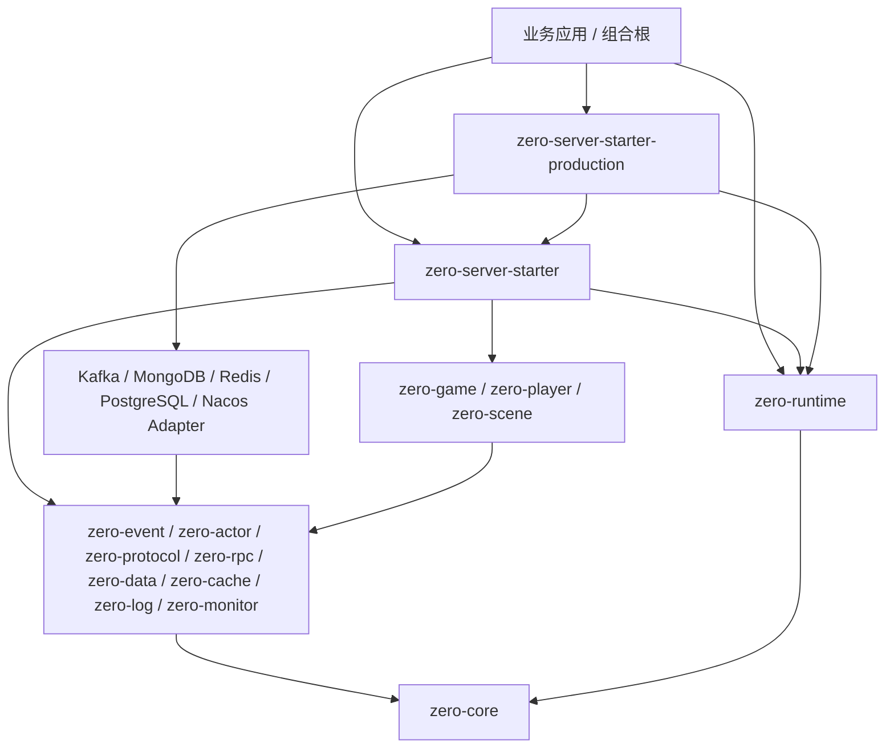

# 模块化运行时装配设计

> 状态：阶段 1 切片 1B、1C、1D 已完成代码收敛，最终全仓验收记录见任务档案

> 按需装配第一批已完成：独立集成层、延迟创建和四种精简消费者已通过 full 15/15；新接入方式及能力键迁移见[按需装配指南](modular-composition-guide.zh-CN.md)。
>
> 适用版本：`0.1.0-SNAPSHOT` 之后的首个破坏性 `0.x` 演进切片
>
> 实现状态：`zero-runtime` 中立契约、共享 capability model、Local/Production Starter、项目生成器和七类模板已迁移；全部现有 Production Adapter 与 network 已使用显式 provider
>
> 评审门：阶段 1 五项设计决策及 1D 五项 Production 迁移契约均已确认；1C 全仓与阶段 0 full 验收已通过

## 1. 结论先行

阶段 1 已新增一个中立的 `zero-runtime` 模块，用它承载运行时组件契约、显式选择、配置校验、依赖图规划、资源事务、生命周期和安全诊断。`zero-runtime` 只依赖 `zero-core`；Local Starter、项目生成器、七类模板和 Production Starter 已经使用该契约。1D 增加 `GameRuntime.optional(...)`、互不复用计时起点的 assembly/startup deadline，并把 Kafka RPC、MongoDB、Redis、PostgreSQL、Nacos 与 production network 迁移为显式 provider，统一接入 typed config、中立 build resource ledger 和适用的 mandatory startup health。具体中间件及业务模块不能被 `zero-runtime` 反向依赖。

首版不引入反射式依赖注入容器，不做 classpath 扫描，不根据 `ServiceLoader`、依赖存在性或 provider 优先级静默选择实现。可用 provider 由代码显式注册到 catalog，最终实现由 preset、部署清单或程序化 override 显式选择。配置只能从 allowlist catalog 中选择稳定 provider ID，不能提交任意类名。

复杂度按以下顺序递增：

```text
minimal：只装配被业务明确请求的本地能力
  -> local：提供当前无 Docker 默认能力的显式预设
  -> standalone：单进程部署，按需接入网络和持久化
  -> production：禁止关键能力回退本地实现，强制健康与安全策略
  -> 多进程/微服务：替换能力 provider，不改变业务服务和事件边界
```

组件图只存在于启动路径。装配完成后生成不可变 typed binding 索引，业务依赖在构造期取得并持有；网络 IO、协议编解码、Actor handler、事件派发、RPC pending、Repository 和 Cache 热路径不做图遍历、反射、动态代理或 ServiceLoader 查询。

## 2. 设计目标与边界

### 2.1 目标

- 让新项目能用一个明确入口构建最小原型，并且只为实际选择的能力付出依赖、资源和启动成本。
- 让本地实现和真实 Adapter 通过同一个业务抽象替换，避免从单体演进到集群时重写业务逻辑。
- 把组件选择、缺失依赖、冲突、循环、配置错误和健康失败提前到启动阶段，并给出稳定、安全、可机器处理的诊断。
- 把 build 资源和 started component 分开记账，保证创建、启动、健康、停止和关闭任一阶段失败时都能确定性回滚。
- 保留当前 Production Starter 已验证的显式 opt-in、fail-fast、累计预算、强制 startup health、single-use、安全异常和逆序清理语义。
- 以 SOLID、明确所有权和不可变装配结果为基础，使组件、Starter、Adapter 和业务模块能够独立测试与演进。
- 让 Maven/BOM 负责二进制版本对齐，让运行时装配只处理当前进程中的能力选择，不实现第二套依赖版本求解器。

### 2.2 非目标

- 不实现玩法、战斗、经济、活动、AOI、帧同步、世界分片或完整运营后台。
- 不改变线程池所有权、Actor lane、协议 wire format、协议 ID、RPC envelope、存储 envelope、缓存 Key 或日志字段。
- 不把运行时拓扑做成热插拔对象图；组件增删、provider 替换和依赖图变化需要重建进程内 runtime。
- 不把 CSV 业务配置热加载并入基础设施装配配置；两者具有不同的一致性、审计和失败边界。
- 不提供 AOP、字段注入、包扫描、任意类实例化、请求 scope、session scope 或通用 Bean 容器。
- 不在首版并行创建或并行启动组件；先以串行确定性和可靠回滚建立正确基线，再凭启动性能证据决定是否增加 DAG 分层并行。
- 不承诺第三方驱动在忽略中断或超时配置时能够被硬 wall-clock 取消。
- 不在运行时求解 Maven/SemVer 范围，也不替代协议和跨服务兼容治理。

## 3. 迁移基线与当前状态

### 3.1 已保留并正式化的行为

1C 在中立契约上保留并验证了以下可靠语义：

- `LocalRuntime.create(...)` 在无 Docker 环境提供确定性本地默认装配。
- `LocalRuntime.builder(...)` 按 typed capability 和 provider ID 显式替换组件，不因 classpath 出现 Adapter 而自动连接外部环境。
- `GameRuntime` 按确定性拓扑启动；启动失败时只回滚实际已启动项；停止按逆序 best-effort 执行并聚合 suppressed 失败。
- `ZeroProductionRuntimeBuilder` 对 Adapter 使用显式选择器，缺失或非法配置 fail-fast。
- Production build 阶段使用资源事务，部分资源创建失败时逆序关闭。
- Production start 强制执行健康检查，同时受累计启动预算和单 Adapter 预算约束。
- Production runtime 为 single-use；报告和异常不会输出密码、token 或原始连接信息。

### 3.2 已解决的限制与剩余边界

迁移前的本地装配器使用固定槽位，直接知道 config、日志、执行器、死信、事件总线、Actor、协议、RPC、持久化、缓存、监控和附加生命周期列表。1C 已删除这套公共入口，改由 descriptor、typed capability、provider 和显式 selection 横向扩展。

`GameRuntime` 的单值/多值 typed binding 与装配计划现在可以表达：

- 一个组件提供多个能力；
- 一个能力有多个候选实现；
- 组件需要、可选使用或冲突于哪些能力；
- 多贡献者集合；
- 能力依赖与仅生命周期排序的区别；
- 为什么选中某个实现；
- 缺失、歧义、冲突和循环的统一诊断。

`ZeroProductionRuntimeBuilder` 当前仅提供全量便利组合，并委托无驱动依赖的 `ProductionAssembly`。Kafka、MongoDB、Redis、PostgreSQL、Nacos 与 network 的配置、创建、健康和资源职责位于各自 `zero-runtime-*` 集成模块；精简业务工程可直接安装所需模块。旧 package-private bridge 和重复 resource scope 已删除。

Local Starter 与 Production Starter 的装配知识都已迁入中立、可验证的模型；剩余集中风险主要位于真实中间件故障恢复、完整 production policy 和容量证据，而不是继续扩大 Production Builder。

## 4. 方案比较

### 4.1 候选方案

| 维度 | A：继续扩展现有 Starter Builder | B：新增中立 `zero-runtime` | C：配置驱动通用 IoC/容器 |
| --- | --- | --- | --- |
| 初始改动 | 最小 | 中等 | 最大 |
| 长期组件扩展 | 固定槽位持续膨胀 | descriptor/provider 横向扩展 | Bean 定义可扩展，但边界宽 |
| 依赖方向 | 装配知识继续锁在 Starter | 中立引擎只依赖 core | 容器容易侵入所有模块 |
| 选择确定性 | 由 Builder 调用保证 | catalog + preset + override 明确保证 | 常见实现依赖扫描、名称和优先级 |
| 启动诊断 | 每个槽位手写 | 图规划统一产生 | 取决于容器，通常偏技术 Bean |
| 回滚与资源所有权 | 每个 Builder 手写 | build/start 双 ledger 统一处理 | 通用容器通常不了解 Adapter 健康和预算 |
| 热路径成本 | 无额外成本 | 装配后不可变索引，无额外成本 | 容易引入代理或运行时查找 |
| 游戏服务器语义 | 逐项定制 | 可直接建模 Actor、执行域、健康和外部 Adapter | 需要大量容器扩展点 |
| 新用户认知 | 初期低，组件增多后高 | 高层 preset 简单，底层模型可解释 | 注解、扫描、scope、条件装配认知较高 |
| 测试隔离 | Builder 与具体模块耦合 | 规划器可用纯 fake provider 测试 | 常需启动容器上下文 |
| 迁移成本 | 低但延后问题 | 一次破坏性迁移，中长期最低 | 最大且容易过度设计 |

### 4.2 推荐方案

选择方案 B。

继续扩展现有 Builder 适合再增加一两个固定能力，但不能支撑按需求组合、多类型项目和持续增加的 Adapter。通用 IoC 能解决对象创建，却不能天然解决游戏服务器所需的线程所有权、外部资源预算、startup health、安全诊断和逆序事务；为这些语义定制后，复杂度会高于专用装配器。

`zero-runtime` 只解决组合根问题，不接管组件内部实现，也不成为请求路径 Service Locator。它是专用装配器，不是通用应用容器。

### 4.3 为什么首版不拆 `zero-runtime-api` / `zero-runtime-impl`

首版只新增一个 Maven 模块，并在源码包内隔离 `api`、`spi`、`config`、`assembly`、`health` 和 `diagnostics`。这样可以先验证真实第三方 provider 是否需要只依赖轻量 SPI 制品。

只有出现以下证据时才考虑拆出独立 API 模块：

- Adapter provider 因传递依赖确实无法接受完整 `zero-runtime`；
- API 和引擎发布节奏已经独立；
- 架构守卫能证明拆分不会产生循环或重复模型；
- 至少两个仓外 provider 验证了拆分价值。

这避免为尚未发布的接口预先增加模块和兼容包袱。`zero-core` 继续只保留生命周期、基础配置、错误和通用 SPI；新的组件装配契约先全部位于 `zero-runtime`，避免核心内核被具体装配模型持续扩张。

## 5. 拟议模块依赖

### 5.1 依赖图



### 5.2 硬边界

- `zero-runtime` 只依赖 `zero-core`，不得依赖 Netty、Kafka、Nacos、数据库驱动、业务模块或任何 Starter。
- `zero-core` 不依赖 `zero-runtime`，现有事件、Actor、协议、RPC、数据、缓存、日志和监控抽象也不反向依赖 Starter。
- 内置 provider wrapper 位于独立 `zero-runtime-*` 集成模块；现有中立端口模块不为了装配而强制依赖 `zero-runtime`。
- `zero-runtime` 只定义泛型 key 类型；引用 `EventBus`、`RpcTransport`、`CacheService` 等具体端口类型的 key 常量与 provider wrapper 一起位于对应集成模块，不能为了放置 key 迫使中立端口模块依赖 `zero-runtime`。
- 第三方组件如果希望直接发布 runtime provider，可以显式依赖 `zero-runtime`；纯 Adapter 仍可只实现原有中立 SPI。
- `zero-server-starter` 只能注册本地、安全、无外部连接的 provider。
- `zero-server-starter-production` 把严格 enabled/mode/network 选择器显式映射为中立 selection；每个真实 Adapter 已拆成 descriptor/provider。显式注册不等于选中，选中不等于健康。
- 业务应用是最终组合根；业务模块不得反向依赖具体 Starter 或具体中间件实现。
- Maven/BOM 管理模块版本；runtime descriptor 不接受依赖版本范围，不做动态下载或类加载。
- 构建工具可由 `zero-codegen` 单向依赖 `zero-runtime` 的逻辑能力模型；该依赖不进入生成项目的运行时依赖，脚手架也不能反向注册 provider。

### 5.3 包职责

已实现包结构如下；这是职责边界，不是要求每个类型单独成包：

```text
group.zn.zero.runtime.api          组件 ID、typed key、runtime 门面
group.zn.zero.runtime.spi          descriptor、provider、creation context、contribution
group.zn.zero.runtime.config       typed key、schema、source、resolved snapshot
group.zn.zero.runtime.assembly     catalog、selection、planner、assembler、ledger
group.zn.zero.runtime.health       startup/readiness/liveness/degraded 契约
group.zn.zero.runtime.diagnostics  安全报告、稳定错误码、异常归一化
```

实现时仍按职责组织源码，单文件不超过 1500 行、方法不超过 100 行，不把规划、配置、生命周期和报告重新堆进一个 Builder。

## 6. 概念模型

### 6.1 四种“模块”概念必须区分

| 概念 | 含义 | 示例 |
| --- | --- | --- |
| Maven 模块 | 编译和依赖边界 | `zero-rpc`、`zero-data-mongo` |
| runtime component | 一个创建、启动、健康和关闭所有权单元 | Kafka RPC transport、local event bus |
| capability/binding | 组件向其他组件或业务提供的 typed 角色 | `rpc.transport`、`player.repository` |
| preset/profile | 显式选择清单与运行政策 | local preset、production profile |

同一个 Java 类型可以承担不同语义角色，因此 capability 不能只以 `Class<?>` 标识。例如主数据 Repository、审计 Repository 和玩家 Repository 即使接口相同，也必须使用不同的稳定 key。

### 6.2 组件身份

`ComponentId` 是 provider/组件的稳定、命名空间化身份，例如：

```text
zero.local.event-bus
zero.local.actor-scheduler
zero.kafka.rpc-transport
zero.mongo.primary-data
acme.game.matchmaking
```

规则：

- 使用小写点号或连字符规范，不能包含类名、地址、租户、密码或部署实例 ID。
- ID 表示实现选择和诊断归因，不等同于分布式服务实例身份。
- 同一 catalog 中 ID 唯一；重复注册直接失败，不允许“最后一个覆盖”。
- runtime 不比较 ComponentId 的版本；制品兼容由 Maven/BOM 和 Java linkage 保证。

### 6.3 typed capability key

单值和多值 binding 使用不同类型，避免把集合基数藏在运行时约定中：

```java
ComponentKey<EventBus> EVENT_BUS =
        ComponentKey.single("zero.event.bus", EventBus.class);

ComponentSetKey<EventInterceptor> EVENT_INTERCEPTORS =
        ComponentSetKey.multiple("zero.event.interceptors", EventInterceptor.class);
```

约束：

- `ComponentKey<T>` 在一个 runtime 中必须恰好绑定一个被请求的实现。
- `ComponentSetKey<T>` 只收集被显式选择的贡献者，顺序按 planner 结果和 ComponentId 稳定排序。
- provider 返回的对象必须通过 key 的运行时类型检查；不匹配在 build 阶段失败。
- 泛型擦除类型仍以语义 key 区分，不能依赖 `CacheService<Object, Object>` 等原始 Class 唯一定位。
- key 是装配期依赖和一次性 bootstrap 获取入口，不鼓励业务请求路径反复查找。

### 6.4 descriptor

每个 provider 返回不可变 descriptor，至少声明：

```java
public record ComponentDescriptor(
        ComponentId id,
        Set<BindingKey<?>> provides,
        Set<BindingKey<?>> requires,
        Set<BindingKey<?>> optional,
        Set<ComponentId> conflictsWith,
        Set<ComponentId> startAfter,
        ConfigSchema configSchema,
        ComponentKind kind) {
}
```

语义：

- `provides`：成功 create 后必须完整提供的 binding。
- `requires`：创建前必须存在的能力，同时形成依赖和启动顺序边。
- `optional`：不会触发 provider 自动选择；能力已经被显式选择时才注入并形成边。
- `conflictsWith`：两个实现不能同时存在时的显式冲突，不替代单值 binding 的重复检查。
- `startAfter`：只表达生命周期排序，不授予访问目标 binding 的权限。
- `configSchema`：只声明该组件拥有的配置键；组件不能读取任意全局字符串 Map。
- `kind`：例如 local、external、business、operations，用于 profile policy 校验，不用于自动选择。

依赖按 capability 而不是具体实现声明，满足依赖倒置。只有真实实现级互斥才使用 ComponentId。

### 6.5 provider 和 contribution

候选 SPI 草图：

```java
public interface RuntimeComponentProvider {

    ComponentDescriptor descriptor();

    ComponentContribution create(ComponentCreationContext context) throws Exception;
}
```

`ComponentCreationContext` 只暴露 descriptor 已声明的 required/optional binding、该组件的 typed config、planning/create 阶段剩余装配预算和当前组件的资源登记器。它不暴露整个可变容器，也不能在 create 时重新注册 provider 或改变选择结果。

```java
public interface ComponentCreationContext {

    <T> T require(ComponentKey<T> key);

    <T> Optional<T> optional(ComponentKey<T> key);

    <T> List<T> requireAll(ComponentSetKey<T> key);

    ComponentConfig config();

    ResourceRegistrar resources();

    RuntimeDeadline assemblyDeadline();
}
```

`ComponentContribution` 使用泛型 builder 绑定对象，并可贡献 lifecycle 和 health probe。provider 只能返回 descriptor 中声明的 key；缺少、额外、重复或类型错误都在 create 后立即拒绝。扩展诊断标签不属于 1B 公共契约，后续只有在低基数和脱敏规则明确后才考虑加入。

资源必须在获得成功后立即通过 `ResourceRegistrar` 登记，不能等 provider 全部创建成功才返回列表。这样 provider 在创建第二个资源时失败，第一个资源仍能被 ledger 逆序关闭。相同关闭义务不得同时以不同 wrapper 重复登记；实现应对同一对象身份的重复登记 fail-fast。

### 6.6 runtime 门面

当前中立门面核心编译面：

```java
public interface GameRuntime extends Lifecycle, AutoCloseable {

    <T> T require(ComponentKey<T> key);

    <T> Optional<T> optional(ComponentKey<T> key);

    <T> List<T> requireAll(ComponentSetKey<T> key);

    RuntimeAssemblyPlan plan();

    RuntimeAssemblyReport report();

    RuntimeHealthSnapshot healthSnapshot();

    @Override
    void close();
}
```

`require`、`optional` 和 `requireAll` 都查询装配后的不可变索引，查找应为常数期望成本。`optional` 只表达当前拓扑可能未选择的单值 capability，不吞掉 provider 创建或启动失败。推荐只在应用组合根取得业务依赖并通过构造器传入 handler/service；禁止在每个消息、请求或 tick 中把 runtime 当作 Service Locator。

为了降低首次上手成本，Local Starter 提供薄入口：

```java
try (GameRuntime runtime = LocalRuntime.create(config)) {
    runtime.start();
    ActorScheduler actorScheduler = runtime.require(ActorRuntime.ACTOR_SCHEDULER);
    LogAppender logAppender = runtime.require(LogRuntime.LOG_APPENDER);
    GameApplication application = new GameApplication(actorScheduler, logAppender);
    application.start();
}
```

该入口展开后仍必须能在 `RuntimeAssemblyReport` 中看到完整 catalog、preset、selection reason 和拓扑，不允许高层便利 API 隐藏实际组件。

## 7. catalog、选择、preset 与 profile

### 7.1 catalog 只声明“可用”

`ComponentCatalog` 是显式 provider allowlist。注册 provider 只表示它可以被选择，不表示启用、创建或连接。

当前 catalog 边界：

- `LocalRuntimeProviders`：内存 EventBus、本地 Actor、local RPC、内存持久化/Cache、安全日志和监控，并由共享 capability model 校验 descriptor。
- Production 已登记 Kafka RPC、MongoDB data、Redis shared resource/data/cache、PostgreSQL data、Nacos discovery/resolver 与 production network provider，并仅在既有选择器明确启用后激活。
- 业务 catalog：项目自己的 matchmaking、world、ranking 等组件。

默认入口不调用 `ServiceLoader.load`。已有 `ZeroProviders.load` 只能通过类似 `importProviders(...)` 的显式 opt-in API 导入，报告必须标记来源；production policy 默认可禁止这种导入。

### 7.2 选择规则

每个单值 capability 的 provider 选择必须来自以下可审计来源之一：

1. 程序化显式选择；
2. 已命名 preset 中的固定选择；
3. 部署 selection 配置中指向 catalog allowlist 的稳定 provider ID。

应用的 capability requirement 只声明“业务需要什么”，不会自行猜测实现。preset 可以预先携带尚未激活的 capability-to-provider 映射；planner 只从应用初始 requirement 出发，沿被映射 provider 的 `requires` 展开最小依赖闭包，闭包外的映射不会创建组件或资源。这里的“显式”要求选择来源和 provider ID 可打印、可审计，并不要求用户在每个项目中重复填写内置 local provider ID。

单值选择使用一个 key 到一个 provider ID 的映射；多值 contribution 使用 key 到有序 provider ID 集合的显式追加。选中一个 provider 后，其 descriptor 声明的全部 `provides` 原子生效；同一 ComponentId 即使被多个 key 引用也只形成一个组件节点。若其任一单值 key 又被映射到另一个已激活 provider，必须报告冲突，不能创建两份实例后再覆盖 binding。

同一个 key 被多个来源给出不同选择时默认报冲突，不使用“最后写入覆盖”。如果调用方确实要覆盖 preset，必须使用语义明确的 `overrideSelection`，报告记录旧选择、新选择和 override 来源，但不记录配置值。

planner 不使用下列条件决定实现：

- classpath 中只有一个候选；
- `ZeroProvider.priority()` 最小；
- provider 注册顺序；
- 某个驱动类可以被加载；
- 某个地址恰好可连接。

required capability 没有显式映射时报告 missing；映射到 catalog 外 ID 时报告 policy/unknown provider；多个单值 provider 同时被选中时报告 duplicate/ambiguous。

### 7.3 preset 是选择清单

`RuntimePreset` 是不可变、可打印的初始 requirement 和 provider selection 清单。它可以减少样板代码，但不包含环境探测，也不修改 profile policy。

预设与计划状态：

| preset | 初始 requirement 与 provider 映射 | 外部连接 |
| --- | --- | --- |
| Local Starter 的 `minimal` preset | 以 config、安全日志、执行器为根；只裁剪运行时选择，全量 Starter 依赖仍在。精简 Maven 工程使用仅 config/执行器的 `RuntimeBasics.builder()` | 禁止 |
| `local` | 完整本地根能力，并携带全部 local provider 显式映射；已由 `LocalRuntimePresets.local()` 实现 | 禁止 |
| `standalone` | 以单进程网络、日志、监控为根；持久化和缓存映射由部署显式补充 | 允许但不默认 |
| `external-test` | 真实 Adapter 的隔离测试选择模板 | 仅显式测试环境 |

`production` 不提供“全部外部组件自动启用”的 preset。它是严格 profile；应用按业务实际需要选择 Kafka、Nacos、MongoDB、Redis、PostgreSQL 等能力。

`local` 默认根能力不打开监听端口。阶段 0 full 验收通过本地 Starter 与独立 TCP generated-dispatcher 示例覆盖环回 Net frame、协议 codec、Actor lane、业务 service、Repository/Cache、日志、指标及关闭；`standalone` 可显式选择 production network provider，但仍必须由应用提供监听 policy，不能只凭 profile 或 classpath 自动打开端口。

### 7.4 profile 是政策，不是隐藏组件包

`RuntimeProfile` 只校验选择结果和运行要求：

| profile | 关键政策 |
| --- | --- |
| `minimal` | 仅允许本地、安全 provider；只要求被业务声明的能力 |
| `local` | 禁止 external kind；允许原型级内存实现；不声称生产容量 |
| `standalone` | 允许显式 external provider；不要求服务发现或跨进程 RPC；安全监听和持久性由声明校验 |
| `production` | 关键持久/分布式能力禁止 local fallback；外部组件必须有 startup health、预算和安全配置来源 |
| `external-test` | 使用 production provider，但要求隔离命名/凭据并明确标记 `productionReady=false` |

profile 不因 classpath 改变选择。报告必须分别展示 profile、preset 和每个 selection reason，防止用户把便利入口误认为隐式魔法。

### 7.5 模块选择器与项目生成器共享模型

切片 1C 已在 `zero-runtime` 增加不含实现类和工厂的 `RuntimeCapabilityModel`：它记录稳定 capability/provider ID、基数、逻辑依赖、provider-specific 依赖、profile 元数据和 Maven 坐标。Local Starter 将具体 typed key/provider descriptor 绑定到该模型并在构建器初始化时校验；1D provider 逐个通过同一模型校验。模型本身不创建组件，也不根据 classpath 补全实现。

阶段 1C 已将脚手架枚举和依赖映射迁入 `zero-codegen` 的独立 `scaffold` 包，使其依赖轻量的 `zero-runtime` 模型。`scripts/NewLocalGame.java` 和需求关键词入口只保留环境检查、参数转发与工具启动，不再拥有第二份 template-to-module 映射。该依赖方向仅存在于构建工具：`zero-codegen -> zero-runtime -> zero-core`，runtime 不依赖 codegen。

每个 `ScaffoldTemplate` 声明实际必须的能力、业务源码依赖和模板资源；`ScaffoldComponents` 从共享 provider 模型计算依赖闭包及集成模块坐标，结合 `--components` 生成 `pom.xml`、`RuntimeAssembly.java`、配置样例和 `zero-scaffold.json`。七类业务模板只默认装配 Actor/日志/监控，协议生成器属于构建插件依赖；新增 `runtime` 模板支持最小工程、事件/Actor、Redis 和自定义 provider。标准模型当前有 22 个 capability、22 个 provider；应用 Repository 目录及本地 discovery 的扩展 provider 在组件接入层登记。验收同时检查生成工程的实际 Maven 依赖和隔离运行类路径。

## 8. typed config 设计

### 8.1 配置键和 schema

当前 `ZeroConfig` 是字符串视图，继续作为底层输入；provider 不应自行散落解析字符串。已实现的 `ConfigKey<T>` 包含：

- 稳定逻辑名称和 owner ComponentId；
- decoder；
- required 或 default；
- validator；
- sensitive 标记；
- reloadability 元数据；
- 可接受 source kind；
- 仅用于安全诊断的说明，不包含值。

每个逻辑 key 必须位于 owner 的稳定配置命名空间内；框架内置键使用 `zero.<domain>.*`，业务和第三方键使用自身反向域名或已登记前缀。catalog 冻结时全局检查逻辑 key 和 source alias 重复，禁止两个组件依赖注册顺序覆盖同名配置。共享配置必须由单独 owner 明确提供，不能通过复制同名 key 暗中共享。

示意：

```java
ComponentId RUNTIME_ID = ComponentId.of("zero.runtime.assembly");
ConfigKey<Duration> STARTUP_TIMEOUT = ConfigKey
        .duration(RUNTIME_ID, "zero.runtime.startup.total-timeout")
        .defaultValue(Duration.ofSeconds(30))
        .validate(value -> !value.isNegative() && !value.isZero(), "positive-duration")
        .build();
```

`ConfigSchema` 由 selected provider 聚合。所有 schema 在创建任何外部资源前一次性验证，尽可能报告完整的缺失/非法 key 集合；敏感 key 的失败只显示逻辑 key、来源类型和错误类别，不显示原值。

### 8.2 来源与优先级

配置来源是显式、有序输入，不由引擎悄悄读取整个进程环境。Production Starter 的便利入口可以保持当前优先级：

```text
程序化/ZeroConfig
  -> JVM system property
  -> environment variable
  -> schema default
```

高优先级来源存在但值非法时立即失败，不能退回低优先级来源。`ResolvedConfigEntry` 只在装配内部持有 typed value；公开报告仅包含：

```text
logicalKey | sourceKind | sourceKeyAlias | sensitive | validationStatus | reloadability
```

`sourceKeyAlias` 也必须经过 allowlist，不能把完整文件路径、URI、用户名或 secret manager 路径原样输出。

### 8.3 topology selection 配置

部署可用配置显式选择 allowlist provider，例如：

```properties
zero.runtime.profile=production
zero.runtime.select.rpc.transport=zero.kafka.rpc-transport
zero.runtime.select.data.primary=zero.mongo.primary-data
zero.runtime.select.cache.distributed=zero.redis.distributed-cache
```

这些值只能匹配已注册 catalog ID，不能是 Java 类名、Maven 坐标、脚本或 URL。旧式 `zero.production.*.enabled=true` 在破坏性迁移切片中改为角色到 provider 的单值选择，避免多个布尔开关组合出矛盾拓扑。

### 8.4 与 CSV 业务热配置分离

运行时装配配置和 CSV 业务配置使用两条链路：

```text
运行时 topology/config schema：启动前解析，决定 provider 和外部资源，startup-only
CSV 业务配置：运行中加载不可变业务快照，校验成功后原子替换，失败保留旧快照
```

阶段 1 不根据 Nacos、文件 WatchService 或 CSV 变化动态增删组件，也不重新绑定 runtime key。需要基础设施配置热更时，必须另行设计每个组件的并发、回滚、集群一致性和审计契约。

## 9. 装配算法

### 9.1 总流程

```text
显式 catalog + preset + profile + application requirements + config sources
  -> 冻结输入并记录来源
  -> 校验 provider/ID/key/schema 注册
  -> 解析显式 selection map
  -> 从 application requirements 展开最小 capability/provider 闭包
  -> 校验缺失、歧义、冲突和 profile policy
  -> 聚合并校验 selected provider 配置
  -> 构建依赖与 startAfter 有向图
  -> 循环检测与确定性拓扑排序
  -> 生成无副作用 AssemblyPlan
  -> 按拓扑顺序 create，并即时登记 build resource
  -> 校验 contribution 并冻结 typed binding 索引
  -> 返回未启动、single-use GameRuntime
  -> 按拓扑顺序 start + startup health
  -> 成功进入 RUNNING，或逆序 stop/close 回滚
```

`diagnose()` 只执行到 `AssemblyPlan`，不能创建 client、打开端口、启动线程或连接中间件。用户可以在部署前安全查看选择、缺口和配置来源。

### 9.2 图边定义

若组件 B `requires` 组件 A 提供的能力，则建立 `A -> B`。optional 能力已经被显式选择时建立同样的边；未选择时不产生节点和边。`startAfter` 只在目标组件存在时建立排序边。

provider 不能在 create 期间增加依赖，否则计划、报告和真实行为会漂移。需要条件能力时，应在 descriptor 构建前由明确的 provider 变体或 selection 表达，不能读取外部连接结果后改变图。

### 9.3 确定性拓扑排序

首版使用 Kahn 算法：

- 入度为零的节点进入按 ComponentId 排序的优先队列；
- 每次取最小稳定 ID；
- 邻接表也按稳定 ID 排序或在冻结时固定；
- 输出对相同输入完全一致；
- 剩余节点不为空时，用 SCC/DFS 补充一条可读循环路径。

目标复杂度为 `O(V + E log V)`，内存为 `O(V + E)`。组件数量相对请求量极小，确定性和诊断质量优先于启动期的微小常数差异。

### 9.4 单值、多值与资源共享

- 单值 key 在 selection 解析后必须恰好一个 provider；多于一个不按优先级猜测。
- 多值 key 收集所有显式选中的贡献者，保持确定顺序，并返回不可变列表。
- 组件节点以 ComponentId 去重；一个 provider 被多个 capability 引用时只 create/start 一次，并原子提交其全部 binding。
- 共享底层资源也建模为 capability。当前 Redis resource provider 提供包内 handle，Redis data 和 distributed cache 分别 requires 它；首个确定性业务 provider 创建并登记唯一 client，而不是两个 provider 私下重复建连接。驱动对象本身不成为公开 typed capability。
- provider 的 capability 应表达语义角色，不能把驱动对象无边界暴露给业务层。
- 禁止隐式 parent/child 容器和运行时 scope；每个 `GameRuntime` 是一个明确所有权边界。

## 10. 生命周期、资源事务与并发

### 10.1 两本 ledger

装配器分别维护：

1. `BuildResourceLedger`：记录 create 阶段已获得且需要 close 的资源；
2. `StartedComponentLedger`：记录已成功完成 start 的 lifecycle。

二者不能合并。一个 client 可能在 runtime 尚未 start 时已经创建，create 失败或用户直接 close 未启动 runtime 时仍必须释放；反之，未成功 start 的 lifecycle 不能调用与“已启动”语义绑定的 stop。

### 10.2 状态机

拟议 runtime 状态：

```text
PLANNED -> BUILT -> STARTING -> RUNNING -> STOPPING -> STOPPED
                    |             |          |
                    +-----------> FAILED <---+

BUILT --close--> CLOSED
STOPPED --close--> CLOSED
FAILED --close/retry failed cleanup--> CLOSED 或保持 FAILED(cleanup pending)
```

规则：

- assembled runtime 全部采用 single-use；任何 start 请求一旦被占用，后续 start 都返回 `RUNTIME_REUSE_REJECTED`。
- 需要重启时重新 build runtime，避免复用已被关闭、部分失败或状态未知的第三方资源。
- `close()` 永久拒绝后续 start；成功关闭项幂等跳过，失败关闭项可在后续 close 中重试。
- `start`、`stop`、`close` 在 runtime 边界串行化；组件内部线程安全仍由各自契约负责。
- runtime 不改变 Actor、IO、logic、remote IO 和 background 执行域规则；执行器作为显式 capability 注入。

### 10.3 创建失败

create 按拓扑顺序串行执行。任何 provider 创建或 contribution 校验失败时：

1. 保留原始阶段、ComponentId 和稳定 ErrorCode；
2. 关闭当前 provider 已即时登记的资源；
3. 按全局获得顺序的逆序关闭之前的 build resources；
4. 继续清理，即使某项 close 失败；
5. 把安全归一化的 cleanup 失败按发生顺序加入 primary failure 的 suppressed；
6. 不返回半成品 runtime。

### 10.4 启动或 startup health 失败

每个组件按拓扑顺序：

```text
component.start()
  -> 记入 StartedComponentLedger
  -> 执行该组件 mandatory startup probe
  -> probe 健康后才启动依赖它的后续组件
```

start 或强制 health 失败时：

1. 以 start/health 原因作为 primary failure；
2. 按 StartedComponentLedger 逆序 stop；
3. 按 BuildResourceLedger 逆序 close；
4. cleanup 失败作为安全 suppressed 聚合；
5. runtime 进入 FAILED，不能重新 start。

如果某组件的 startup probe 必须等所有组件启动，后续切片可增加显式 runtime-level final probe；这种 probe 不替代组件自己的最小可用性检查，并应在整图启动后、对外 readiness 之前执行。1B 尚未提供 final probe 契约。

### 10.5 正常停止

正常 stop 严格按实际启动顺序逆序执行，不能重新计算当前图。所有 stop 都尝试后再关闭 build resources；首个 stop/close 失败作为主异常，后续安全失败作为 suppressed。对外报告保留失败组件、阶段、耗时和 ErrorCode，不包含资源对象 `toString()`。

### 10.6 预算与超时

`RuntimeDeadline` 使用单调时钟并提供单个阶段的总剩余时间。装配器为 planning/config/create 创建 assembly deadline；`GameRuntime` 在第一次 `start()` 时另行创建 startup deadline，并只用于 lifecycle start 与 mandatory startup health。两条 deadline 具有独立计时起点，资源创建耗时不会被悄悄计入既有 Production 启动预算，也不能跨阶段复用同一实例。

当前实现分别提供 `assemblyTimeout(...)` 与 `startupTimeout(...)`。如果 profile 后续增加每组件上限，实际传给 provider 或启动阶段的预算应为：

```text
min(current phase remaining, component maximum, adapter configured timeout)
```

所有外部 provider 必须把预算下推到驱动连接、请求和 health probe 超时。装配器可以在受管执行域等待异步 probe，但不会承诺强制终止忽略中断、没有超时入口或已进入 native call 的第三方代码。超时时先返回安全失败并开始清理；如果驱动无法及时停止，报告明确标记 cleanup pending，而不是伪装已完全回收。

首版串行启动。只有真实装配基准证明启动成为瓶颈，并完成同层组件资源竞争、日志顺序、预算分配和回滚测试后，才考虑显式 opt-in 的 DAG 分层并行。

## 11. 健康、就绪与降级

### 11.1 健康类型

| 类型 | 用途 | 默认语义 |
| --- | --- | --- |
| startup | 证明组件在启动窗口内达到最小可用 | production external 必须 `HEALTHY`，否则回滚 |
| readiness | 判断当前实例是否应接收新流量 | 依赖不可用可变为 not-ready，不必立即杀进程 |
| liveness | 判断本进程是否失去自行恢复能力 | 只检查本地活性，避免远程依赖抖动触发重启风暴 |
| degraded | 表示仍可服务但能力/容量下降 | 报告原因和受影响 capability，由 policy 决定 readiness |

候选状态：`HEALTHY`、`DEGRADED`、`UNHEALTHY`、`UNKNOWN`。健康详情只能使用稳定 code 和安全文本，不能返回原始异常、URI、topic、namespace、用户名或查询结果。

### 11.2 probe 草图

```java
public interface HealthProbe {

    CompletionStage<HealthResult> check(HealthRequest request);
}

public record HealthRequest(
        HealthPhase phase,
        Duration timeout,
        Instant requestedAt) {
}
```

probe 不在网络/Actor 热路径执行，由启动器或受管 health supervisor 调用。liveness 不应依赖 Kafka、Redis、MongoDB、PostgreSQL 或 Nacos 的瞬时可达性；readiness 可以表达这些依赖对新请求的影响。

### 11.3 阶段 1 实现边界

阶段 1 首个实现切片只要求统一 startup health 和可查询的静态 health contribution。周期 readiness/liveness supervisor、自动恢复、熔断和集群摘流属于后续阶段；公共健康契约需要为其保留语义，但不能在能力矩阵中提前标为 implemented。

## 12. 诊断与错误模型

### 12.1 报告层次

| 报告 | 产生时机 | 是否允许副作用 | 内容 |
| --- | --- | --- | --- |
| `RuntimeAssemblyPlan` | selection/config/graph 校验后 | 否 | 节点、边、顺序、选择原因、policy 结果 |
| `RuntimeAssemblyReport` | build/start/stop 期间 | 只读已存在状态 | 实现类型、阶段、耗时、健康、失败与 cleanup |
| `RuntimeHealthSnapshot` | 运行期按需读取 | 读取不触发 probe | 1B 返回 startup 结果及 readiness/liveness 的 `UNKNOWN` 占位；后续 supervisor 才显式触发周期 probe |

每个选中组件至少报告：

- ComponentId 和提供的 capability key；
- selection reason 及来源类型；
- provider 实现类型和 catalog 来源；
- required/optional/startAfter 边；
- config logical key、source kind、sensitive 和校验状态；
- create/start/health/stop/close 状态与耗时；
- 稳定 ErrorCode 和安全 detail；
- build resource 与 started component 的 cleanup 完成状态。

生产报告可继续隐藏 runtime application name。报告对象不持有原始配置值，防止后续序列化或 `toString()` 意外泄漏。

### 12.2 稳定错误码

拟议错误码至少覆盖：

```text
RUNTIME_DUPLICATE_PROVIDER
RUNTIME_DUPLICATE_BINDING
RUNTIME_DUPLICATE_CONFIG_KEY
RUNTIME_UNKNOWN_PROVIDER
RUNTIME_MISSING_CAPABILITY
RUNTIME_AMBIGUOUS_CAPABILITY
RUNTIME_COMPONENT_CONFLICT
RUNTIME_DEPENDENCY_CYCLE
RUNTIME_CONFIG_MISSING
RUNTIME_CONFIG_INVALID
RUNTIME_POLICY_REJECTED
RUNTIME_CONTRIBUTION_INVALID
RUNTIME_COMPONENT_CREATE_FAILED
RUNTIME_COMPONENT_START_FAILED
RUNTIME_COMPONENT_HEALTH_FAILED
RUNTIME_STARTUP_TIMEOUT
RUNTIME_COMPONENT_STOP_FAILED
RUNTIME_RESOURCE_CLOSE_FAILED
RUNTIME_REUSE_REJECTED
```

首版在 `zero-runtime` 内新增 `RuntimeErrorCode implements ErrorCode`，稳定外部 code 使用 `ZERO-RUNTIME-*` 前缀；不把装配错误继续塞入 `SystemErrorCode`，也不让 `zero-core` 反向知道 runtime。现有 Production Adapter 错误码在迁移表中逐项映射，但在 1D 前不提前改名。异常消息只包含逻辑 ID/key/phase，不拼接 raw cause message；公开 `RuntimeAssemblyException` 不附加 raw cause。后续若接入受控内部诊断 sink，只能在明确访问边界和脱敏策略后记录原始故障，不能改变公开异常与报告的安全形态。

## 13. 性能设计

### 13.1 启动路径

- provider descriptor、catalog、selection、schema 和 graph 冻结为不可变结构。
- graph 规划目标为 `O(V + E log V)`；不做反射扫描和运行时版本求解。
- selected provider 默认 eager create，尽早发现配置和外部资源问题；首版不引入 lazy singleton 的并发状态机。
- create/start 串行以获得可复现报告和可靠回滚；是否并行由后续证据决定。
- 每个阶段使用 `System.nanoTime()` 或注入的单调时钟计算预算和耗时。

### 13.2 稳态路径

- binding 索引在 build 后不可变，单值 key 至少达到常数期望查找；高层 typed facade 可以在构造时缓存字段。
- handler/service 依赖通过构造器持有，不在每请求查询 runtime。
- 不生成动态代理，不拦截业务方法，不做注解扫描。
- health 和 diagnostics 在受管后台路径运行，不共享 Actor mailbox 或 Netty event loop。
- planner、descriptor、schema 和 selection 对象在启动后可由 runtime 只读持有或压缩为报告，不参与事件派发。

### 13.3 性能验收

实现切片至少增加：

- 1、32、128、512 个 fake component 的 plan/build 微基准；
- 稀疏 DAG、宽 DAG、深链和显式多 binding 场景；
- binding bootstrap 查询成本和分配量；
- 证明现有 EventBus、Actor、Protocol、RPC、Repository、Cache 基准不因装配迁移出现统计显著回退；
- 启动报告明确测试 JDK、CPU、组件数和图形状，不把装配微基准解释为生产吞吐或 SLA。

阶段 1 的核心性能承诺是“稳态不增加框架热路径工作”，而不是用未验证数字宣称最高容量。

## 14. 安全设计

- catalog 是 provider allowlist；配置不能加载任意类、脚本、JAR 或远程制品。
- classpath 和 ServiceLoader 不默认启用组件；显式导入也必须进入报告并受 production policy 限制。
- external provider 只有被显式选择后才允许解析自己的连接配置和创建资源。
- schema 在 provider create 前完成，敏感值只存在于最小作用域的 resolved config，不进入 descriptor、plan、report、异常文本或日志字段。
- 配置非法时不打印原值长度、前后缀、hash 或完整 source path，避免侧信道和凭据定位信息泄漏。
- provider/driver 异常跨装配边界时使用稳定错误码和固定安全文本；不得直接透传 `Throwable#getMessage()`。
- runtime 不调用未知组件的 `toString()` 生成报告。
- profile 可禁止 local fallback、未知 catalog、未声明 health、外部监听或不安全配置来源。
- 同一 JVM 中的业务组件不是安全沙箱；不可信插件必须放入独立进程，通过明确协议/RPC 边界隔离。
- 装配迁移不改变现有日志字段、审计字段、TraceId 和 ErrorCode 对外结构；如确需修改必须单独暂停确认。

## 15. 从单体到集群的演进

业务依赖能力角色，而不是实现：

| 阶段 | capability | provider 替换 | 业务侧保持 |
| --- | --- | --- | --- |
| 最小原型 | event bus、actor、repository、cache | 全部 local/in-memory | EventBO、service、Repository 接口 |
| 模块化单体 | network、managed executors、local RPC | 单进程实现 | handler、Actor lane、业务事件 |
| standalone | durable data、distributed cache | Mongo/PostgreSQL/Redis 可按需显式接入 | 数据访问抽象和业务模型 |
| 多进程 | rpc transport、discovery、remote actor gateway | Kafka/Nacos/remote gateway | 服务接口、Actor message 边界 |
| 微服务 | 按服务拆分 runtime catalog/preset | 每进程只选择所需 provider | 协议、事件、服务契约 |

装配器只负责替换进程内 capability provider，不宣称自动完成数据切换、双写、分片、Actor 迁移或协议兼容。这些迁移涉及分布式状态和业务一致性，必须分别设计和验证。

一个模块化单体也应避免业务代码直接持有 MongoClient、RedisClient、Kafka producer 或 Nacos SDK。驱动对象最多作为内部 provider 依赖，业务继续使用 Repository、CacheService、RpcTransport、ServiceDiscovery 等中立端口。

## 16. 破坏性迁移方案

用户已确认项目尚未发布，允许带迁移说明的 `0.x` 破坏性调整。因此推荐在一个受控切片内完成 Starter 公共装配入口迁移，并同步更新所有仓内调用方，不保留长期兼容 facade。

### 16.1 当前 API 对照

| 使用需求 | 当前入口 | 迁移说明 |
| --- | --- | --- |
| 默认本地 runtime | `LocalRuntime.create(...)` | 使用显式 local preset，默认无外部连接 |
| 可定制本地 runtime | `LocalRuntime.builder(...)` | 返回 `LocalRuntimeBuilder`；构建前可 `diagnose()` |
| 替换单值能力 | `register(provider)` + `override(key, providerId)`，或 `replace(key, value)` | 按 typed capability 选择，不扩展固定槽位 |
| 增加生命周期 | `addInfrastructureLifecycle(...)` / `addApplicationLifecycle(...)` | 显式声明层级并进入统一依赖图 |
| 取得运行能力 | `GameRuntime.require(KEY)` / `requireAll(KEY)` | 只在组合根取得，业务 service 使用构造器注入 |
| 装配诊断 | `LocalRuntimeBuilder.diagnose()`、`GameRuntime.plan()` / `report()` | 使用 `RuntimeAssemblyPlan` / `RuntimeAssemblyReport`，包含选择来源、拓扑、配置元数据和阶段状态 |
| Production 中立入口 | `ZeroProductionRuntime` 直接实现 `GameRuntime` | 使用 `require/optional/requireAll` 读取中立能力；标准图报告为 `report()`，Adapter 诊断为 `productionReport()` |
| Production Adapter 选择 | 现有严格 enabled/mode 配置 | 1D 在规划前映射为显式 provider selection，不改变精确解析语义 |
| Production Adapter 对象 | 不提供驱动 getter | 业务依赖各 `zero-runtime-*` 集成入口提供的中立 typed capability |

上述入口是当前实现，不是候选命名。仓内调用方已在同一 `0.x` 切片完成编译迁移，不保留旧公共 facade。

### 16.2 一次迁移范围

公共切片必须同步修改：

- root reactor、`zero-bom` 和架构守卫；
- local/production Starter；
- 所有 Starter 单元和集成测试；
- 五类独立示例；
- 七类项目模板及结构检查；
- `zero-codegen` project-scaffold 工具和需求关键词选择入口；
- quickstart、README、module map、capability matrix 和 migration guide；
- external test 入口和后续 Docker 验证脚本。

不保留已删除固定槽位 API 或旧 network factory 到新 assembler 的长期双轨兼容层，因为双轨会迫使每个新能力维护两套选择、配置、生命周期和诊断语义。1D 已删除 `ProductionLocalAssembly`、重复 resource scope 和驱动 getter。

### 16.3 必须保留的行为

- 本地默认入口绝不连接真实外部中间件。
- Adapter 必须显式选择，不能由 classpath 自动启用。
- production 缺少必要选择/配置时 fail-fast，不能回退 local。
- 创建失败逆序关闭 build resources。
- 启动/健康失败逆序停止实际已启动组件，再关闭资源。
- startup health、累计预算和单组件 timeout 继续强制执行。
- runtime single-use；close-before-start 能释放资源并拒绝后续 start。
- 报告、异常和日志不泄漏凭据或原始连接信息。

## 17. 测试与验收矩阵

### 17.1 planner 与类型系统

| 场景 | 预期 |
| --- | --- |
| 重复 ComponentId | 注册阶段稳定失败 |
| 单值 key 重复 provider | ambiguous/duplicate，禁止按优先级选择 |
| required capability 缺失 | 创建资源前失败，列出 consumer 和 key |
| optional 未选择 | 不增加节点，不失败 |
| optional 已选择 | 注入并形成依赖边 |
| conflicts 同时选中 | 创建资源前失败 |
| dependency/startAfter 循环 | 输出稳定循环路径 |
| 相同输入不同注册顺序 | 得到相同拓扑和报告 |
| contribution 类型/数量错误 | create 阶段立即失败并回滚 |
| 多 binding | 只收集显式贡献者且顺序确定 |
| profile 拒绝 local/external | policy 阶段失败 |

### 17.2 配置与安全

- required/default/decoder/validator/source precedence 全分支测试。
- 高优先级非法值不能降级读取低优先级来源。
- selection 只能引用 allowlist ID；类名、未知 ID 和冲突 override 被拒绝。
- 使用唯一 secret 哨兵覆盖 plan、report、异常、cause、suppressed 和日志，断言任何文本中均不存在哨兵。
- sensitive/non-sensitive key 的 source metadata 正确且不包含原始 URI/path。
- topology config 变化不会在运行中的 runtime 动态重绑。

### 17.3 生命周期与失败矩阵

- 第一个/中间/最后一个 provider create 失败。
- lifecycle start 前、start 中、startup health 和 final health 失败。
- stop、resource close 同时出现一个或多个失败，验证主异常和 suppressed 顺序。
- close-before-start、double close、start-after-close、start-after-failed、并发 start/close。
- 只 stop 实际成功启动的组件，资源严格按实际获得顺序逆序关闭。
- cleanup 某项成功后后续 close 不重复；失败项允许重试。
- timeout 使用可控单调时钟测试，不依赖真实 sleep。

### 17.4 架构与黑盒

- 架构守卫验证 `zero-runtime -> zero-core` 是唯一 runtime 下行依赖。
- `zero-core` 和中立模块不能依赖 Starter/Adapter；Adapter 不能反向依赖 Starter。
- 默认入口禁止 ServiceLoader/classpath 自动选择。
- 模块选择器与 generator 使用同一 `RuntimeCapabilityModel`，七类 recipe 的解析结果与生成 POM/manifest 一致。
- 阶段 0 quick/full 验收在迁移后继续通过。
- 五类示例和七类脚手架真实生成、测试和运行。
- Linux/Windows Java 21 验证命令与输出编码。

### 17.5 真实中间件

用户已经允许后续使用隔离 Docker 环境。该验证不属于本设计稿实现，但 production provider 迁移后必须覆盖：

| 中间件 | 正常路径 | 故障与恢复 |
| --- | --- | --- |
| Kafka | RPC request/response、oneway、broadcast、startup health | broker 不可达、请求超时、恢复后新请求、关闭清理 |
| Nacos | 注册、查询、订阅、RPC resolver | server 中断、注册失败、恢复/重新订阅、摘除 |
| Redis | data journal、distributed cache、共享 client | 连接中断、超时、恢复、版本/缓存行为 |
| MongoDB | envelope CRUD、健康 | server 中断、超时、恢复、资源关闭 |
| PostgreSQL | JDBC envelope、健康 | 连接拒绝、查询超时、恢复、事务/关闭 |

测试环境必须使用唯一 Compose project 名、环回端口、隔离凭据和 target 下证据；启动前解析精确容器/卷/端口，结束后验证清理。真实 Adapter 通过不等于容量、长稳或生产就绪。

## 18. 分阶段实施与停止门

### 18.1 切片 1A：设计确认（已完成）

- 交付本文、阶段 0 统一验收和现状证据。
- 确认模块位置、选择语义、profile、single-use、typed config 和破坏性迁移策略。
- 不新增 `zero-runtime`，不修改公共 Starter API。

**停止门：** 维护者已于 2026-08-11 确认本文列出的五项决策，允许进入 1B。

### 18.2 切片 1B：中立装配内核（已完成）

- 新增 `zero-runtime`、BOM 条目和架构守卫。
- 只使用 fake provider 完成 ID/key/descriptor/catalog/selection/planner/schema/ledger/report。
- 完成稳定错误码、安全诊断、single-use runtime 和失败矩阵。
- 不迁移真实 Starter/Adapter，不改变线程/Actor/协议/RPC/存储语义。

**停止门结果：** 公共 API/SPI 编译面、错误码和生命周期契约已复审确认，允许 1C 使用通用中立契约。

### 18.3 切片 1C：本地 Starter 与共享模型迁移（已实现，收尾验收）

- 建立 local provider catalog、minimal/local preset 和薄入口。
- 将项目选择器与 generator 迁移到共享 capability model，source-file 脚本只保留薄启动职责。
- 在一个破坏性切片中替换固定槽位 Builder/Components/Factory。
- 同步迁移全部示例、模板、测试和文档。
- 阶段 0 quick/full 必须继续通过。

Production Starter 已完成正式 provider 迁移并直接实现同一个 `GameRuntime` 契约；这仍不等同于真实外部环境、恢复、容量或 production-ready 证明。

**当前停止门：** 架构守卫、全仓 test/quality/integration、阶段 0 quick/full 全部通过；本地行为等价且无外部连接。稳态性能仍以既有 focused 基准为边界，不把本次功能验收解释为新的容量结论。

### 18.4 切片 1D：Production Starter 迁移（代码收敛已完成）

- **1D-0 已实现**：增加 `GameRuntime.optional(...)`，分离 assembly/startup deadline，补齐 `standalone`、`external-test`、`production` profile 及 data/discovery/resolver/network 中立 capability 词汇；该切片当时未提前登记尚未实现的 Production provider。
- **1D-1 已实现**：Kafka RPC 使用正式 provider ID、显式双 capability 选择、typed startup schema、provider-specific 日志依赖、单组件 lifecycle/startup health 和既有安全属性白名单；build 不连接 broker。
- **1D-2 已实现**：MongoDB data 使用正式 provider ID、敏感 typed schema、多值 `DataService` contribution 和单组件 lifecycle/startup health；client 获得后立即登记到中立 build resource ledger，build 不要求数据库可达。
- **1D-3 已实现**：Redis 使用一个包内 resource handle 与独立 data/cache provider；两项 enabled 选择共享唯一 ledger client，同时贡献中立 `DataService`/`CacheService` 并保留各自 startup health。
- **1D-4 已实现**：PostgreSQL data 使用敏感 typed schema、多值 `DataService` 与 mandatory startup health。
- **1D-5 已实现**：Nacos discovery 与 RPC resolver 通过显式能力依赖协作，只有 discovery 承担 external lifecycle 和 startup health。
- **1D-6 已实现**：network provider 要求显式 policy、非内联 remote IO executor、10 项非敏感 typed config，并支持默认或自定义有界 limiter。
- **1D-7 已实现**：`ZeroProductionRuntime` 直接实现 `GameRuntime`；删除驱动 getter、package-private bridge、重复 resource scope 和旧 network factory。

**当前结果：** 1D 五项迁移契约已确认并完成代码收敛。既有选择语义、启动健康预算和安全错误归因保持不变，所有 client 由中立资源账本管理。最终全仓与阶段 0 验收结果记录在任务 `VERIFY.md`；外部中间件行为仍留给后续切片。

**最终停止门：** 现有 production contract tests 全部迁移并通过，安全哨兵无泄漏，无外部中间件路径持续全绿。

### 18.5 切片 1E：真实 Adapter 故障与恢复

- 启动隔离 Docker 中间件。
- 执行正常、故障、超时、恢复和关闭测试。
- 记录版本、端口、配置来源、证据与精确清理结果。

**停止门：** 每个中间件的剩余风险清楚记录；不把集成通过升级为生产容量承诺。

### 18.6 切片 1F：易用性与性能证据

- 收敛最小入口、错误提示、脚手架 component manifest 和迁移指南。
- 完成装配微基准和既有热路径回归。
- 根据证据决定是否需要拆 API 模块或增加启动分层并行；没有证据则保持简单。

## 19. 已确认的设计决策

维护者已确认以下五项决策，并据此授权实现切片 1B；随后又确认使用通用中立契约完成 1C 的破坏性迁移：

1. **模块边界**：新增单一中立 `zero-runtime`，首版 API/SPI、引擎与 `RuntimeErrorCode` 同模块按包隔离，且只依赖 `zero-core`；具体端口 key 位于 Starter 装配包，`zero-codegen` 仅作为构建工具单向依赖其逻辑能力模型。
2. **选择边界**：catalog 显式注册、preset/部署清单/override 显式选择；默认禁止 classpath/ServiceLoader/priority 自动装配。
3. **运行边界**：profile 是政策、preset 是清单；runtime 全部 single-use，拓扑变化通过重建完成。
4. **配置边界**：基础设施使用 typed startup schema；CSV 业务热配置保持独立；production 禁止关键能力 local fallback。
5. **迁移边界**：在一个 `0.x` 切片中破坏性迁移 Starter、示例、模板和文档，不维护双轨兼容层。

1C 追加确认覆盖 Local Starter、共享能力模型、生成器、模板及 Production 包内桥接。随后确认的 1D 五项契约授权：保持既有严格配置选择语义、以中立 typed capability 取代驱动 getter、分离 assembly/startup deadline、按 Adapter 原子切片迁移，并在最终切片统一删除 package-private bridge 与重复 resource scope。

该授权不包含线程/Actor、协议 wire format、RPC 行为、存储 envelope、缓存 key、日志字段、权限或真正的动态热更；这些边界发生变化时仍需单独评审。

## 20. 切片 1B/1C/1D 完成定义

切片 1B 被视为完成，需要满足：

- `zero-runtime` 进入 Reactor 与 BOM，非测试直接依赖恰好只有 `zero-core`，并由架构守卫持续验证。
- 公共 API/SPI、配置、图算法、双资源账本、健康、错误码和安全诊断可以独立复审。
- fake provider 测试覆盖确定性选择、缺失/冲突/循环、配置、创建/启动/健康失败、逆序回滚、清理重试、single-use 和并发关闭。
- Local Starter、Production Starter、示例、模板、脚手架和共享 capability model 使用同一中立契约；默认路径没有外部连接，也没有改变 Adapter 选择语义。
- 本文、README、模块图、能力矩阵、任务档案和机器可读守卫摘要与代码事实一致。
- 七类脚手架和五类仓库独立示例完成黑盒验证；阶段 0 quick/full 保持可复现。
- 1D 的真实 Adapter provider、Production Builder/门面收敛均已完成；完整 production policy、真实中间件故障恢复和容量证据留在后续切片，当前不得宣称 production ready。
