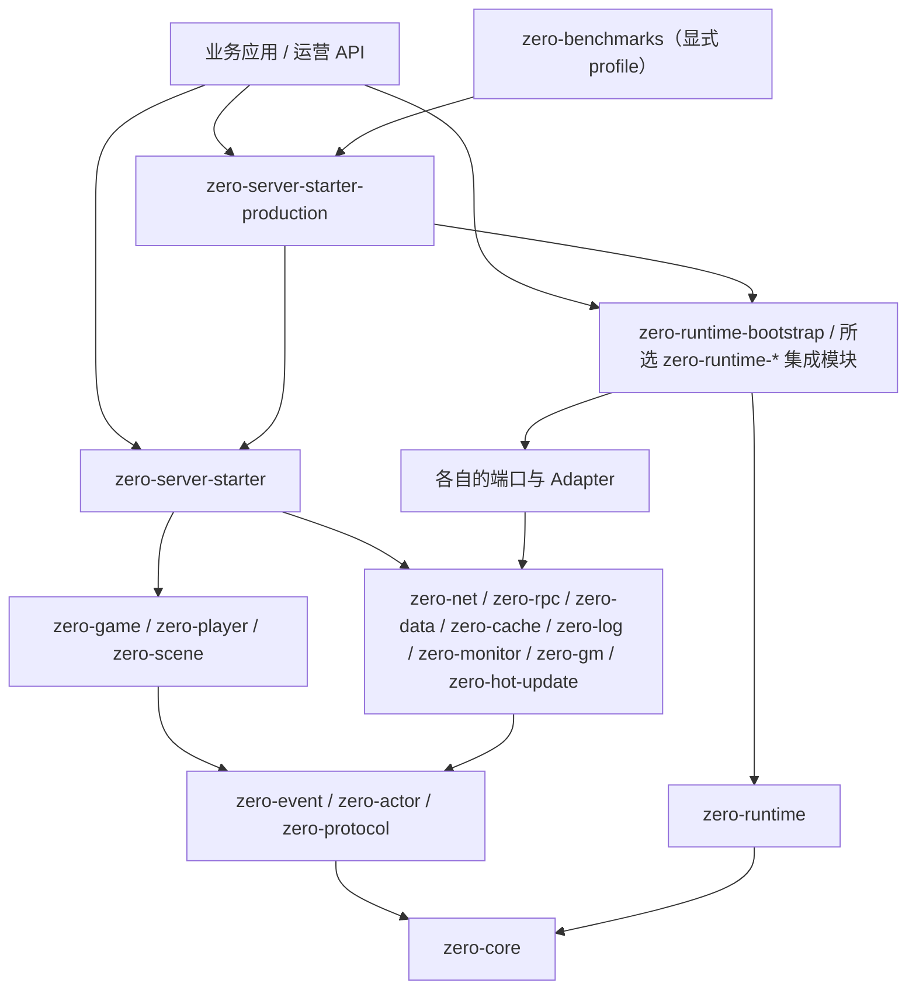

# zeroServer 模块图


性能增量入口（2026-09-23）：`zero-event/bus/InMemoryEventBus` 负责单版本注册快照和异步续调；
`zero-aoi/ObserverState` 保存观察者代次和原始序号，候选工作区由 `InMemoryAoiIndex` 管理；
`zero-protocol/buffer/ReadOnlyZeroBuffer` 适配只读输入，`ProtocolCodec.decodeView` 提供自定义 codec 默认回退，
Java dispatcher 模板生成 `dispatchFrame`。`LocalRankingService` 维护最多 100 引用的单项 Top 缓存。
模块依赖、业务执行域不变；主要风险为阶段交接、借用内容稳定性与回调重入，详见[增量迁移](migrations/20260923-performance-incremental.md)。

本文给出 zeroServer 当前公开模块的职责、依赖方向、核心入口、常见修改位置、禁止依赖与风险边界。模块、包结构、核心入口或依赖方向发生变化时，应同步更新本文和对应测试。

2026-09-22 常见修改入口：`zero-rpc-kafka/KafkaRpcConsumerBatch` 在 consumer 线程管理批次异步确认与重平衡；
`zero-runtime-kafka/KafkaRuntime.module(properties, verifier)` 注入应用安全验证器；
`NettyHttpServer` 使用请求级验证身份；`PrometheusHttpEndpoint` 接收外部异步执行器和可选 token。
依赖方向不变，安全验证材料由应用持有。RPC 重投与鉴权配置风险见[迁移说明](migrations/20260922-security-storage-concurrency.md)。

性能路径入口：`zero-actor/scheduler/ExecutorActorScheduler` 维护分段 lane 队列，
`OrderedActorHandlers` 负责有序注册快照；`zero-aoi/SpatialGrid` 负责空间桶，
`InMemoryAoiIndex` 负责实体和观察者增量；`zero-protocol/codec/EncodingWriters` 负责同步编码临时缓冲复用，
`buffer/NativeMemoryZeroBuffer` 负责显式 native 生命周期。以上辅助类均为包内实现，无新增模块依赖。
常见风险是 lane 回收竞态、网格边界漏查和缓冲借用视图逃逸，详见[迁移说明](migrations/20260922-performance-feedback.md)。

## 1. 总体分层与依赖方向

zeroServer 的基本形态是“游戏专用运行时内核 + Starter / Adapter 生态”。依赖只能从上层指向下层抽象，核心模块不感知具体中间件。



硬边界：

- `zero-core` 不依赖 Netty、Kafka、MongoDB、Redis、PostgreSQL、Nacos、日志实现或监控实现。
- `zero-runtime` 的非测试直接依赖必须且只能是 `zero-core`；它不扫描 classpath，也不反向依赖 Starter、Adapter 或业务模块。
- `zero-event`、`zero-protocol`、`zero-actor` 只建立在核心抽象之上，不绑定具体基础设施。
- `zero-rpc`、`zero-data` 提供中立抽象；具体实现位于 `zero-rpc-kafka`、`zero-data-*`。
- 默认 `zero-server-starter` 保持无外部中间件可运行；真实 Adapter 由业务项目或 `zero-server-starter-production` 显式接入。
- 业务代码不得自行创建线程池；执行域由 bootstrap 集成统一装配，受管调度器由对应组合根管理。
- 玩家、场景等核心状态遵循 Actor / lane 线程绑定；跨 Actor 修改通过消息完成。
- `zero-benchmarks` 是显式启用的证据叶子，任何运行时模块都不得反向依赖它。

## 2. 构建与版本模块

| 模块 | 职责 | 核心入口 / 修改位置 | 禁止依赖与主要风险 |
| --- | --- | --- | --- |
| `zero-parent` | Java 21、插件版本、测试与质量 profile 的统一父 POM | `zero-parent/pom.xml` | 修改编译器、Surefire、Failsafe、Checkstyle、PMD、SpotBugs、JaCoCo 会影响全部模块 |
| `zero-bom` | 对外提供 zeroServer 模块版本对齐 | `zero-bom/pom.xml` | 不承载运行时代码；新增模块后要同步依赖管理 |

## 3. 核心内核与基础抽象

| 模块 | 职责 | 核心入口 | 常见修改位置 | 禁止依赖与主要风险 |
| --- | --- | --- | --- | --- |
| `zero-security` | 传输中立的认证、重放、TLS 材料与安全上下文契约 | `AuthenticationProvider`、`SecurityContext`、`ReplayProtection`、`TlsMaterialProvider`、`SecurityChain` | `zero-security/src/main/java/group/zn/zero/security` | 仅依赖 `zero-core`；不内置账号/JWT/证书供应商；安全 provider 必须显式注入，敏感字段禁止进入上下文 |
| `zero-runtime` | 显式组件选择、typed config、依赖图、事务式生命周期、健康、安全诊断与共享能力模型 | `RuntimeAssembler`、`GameRuntime`、`ComponentCatalog`、`RuntimeProfile`、`RuntimeCapabilityModel` | `zero-runtime/src/main/java/group/zn/zero/runtime` | 只依赖 `zero-core`；禁止 classpath 自动装配和具体端口/Adapter 依赖；公共契约已用于 1C Local 装配 |
| `zero-event` | 事件总线、优先级、拦截、重试与死信抽象 | `EventBus`、`InMemoryEventBus`、`EventHandler`、`EventInterceptor` | `zero-event/src/main/java/group/zn/zero/event` | 不绑定网络或消息队列；派发顺序、重试和异常语义属于高风险行为 |
| `zero-protocol` | 协议模型、注册表、frame 与 codec SPI | `ProtocolCodec`、`ProtocolFrameCodec`、`ProtocolRegistry`、`ProtocolDefinition` | `zero-protocol/src/main/java/group/zn/zero/protocol` | 协议 ID、wire format、兼容策略与编解码变化会影响客户端和跨服通信 |
| `zero-codegen` | 协议 DSL 解析与 Java / C# / TypeScript / GDScript 代码生成 | `ProtocolCodegenCli`、`ProtocolCodegenRunner`、`DefaultProtocolDslParser`、`DefaultCodeGenerator`、`GeneratedSourceWriter`、`ProjectScaffoldCli`、`ScaffoldUpgradeService` | `zero-codegen/src/main/java/group/zn/zero/codegen`、`generator/GeneratedSourceWriter.java`、`src/main/resources/codegen/java/dispatcher.java.ftl`、`zero-codegen/src/test` | 依赖 runtime/protocol，不依赖 net/logic；BOImp 只创建一次，其他协议产物按生成标记更新且同内容不写；协议生成与 scaffold ownership 独立；生成 dispatcher 应放业务/装配模块 |
| `zero-actor` | Actor 地址、lane key、调度、路由与跨 Actor 消息抽象 | `ActorScheduler`、`ExecutorActorScheduler`、`LocalActorScheduler`、`ActorRouteResolver` | `zero-actor/src/main/java/group/zn/zero/actor` | 禁止直接绑定 RPC、Netty 或中间件；调度、队列、线程归属和背压是关键性能路径 |
| `zero-world` | Actor-owned 本地 world/shard、实体归属、迁移状态机、不可变查询快照与低基数观测最小切片 | `LocalWorldService`、`World`、`Shard`、`Entity`、`Migration` | `zero-world/src/main/java/group/zn/zero/world` | 仅依赖 `zero-actor`；禁止 RPC、数据库、缓存、网络、执行器和高基数指标；不包含跨进程迁移 |

## 4. 游戏业务抽象

| 模块 | 职责 | 核心入口 | 常见修改位置 | 禁止依赖与主要风险 |
| --- | --- | --- | --- | --- |
| `zero-game` | 游戏请求上下文、执行域和 Actor 网关 | `GameRequestContext`、`GameExecutionDomain`、`GameActorGateway` | `zero-game/src/main/java/group/zn/zero/game` | 不引入具体存储或传输；上下文、lane 映射和 TraceId 传播变化需跨模块验证 |
| `zero-player` | 登录、UID 解析、玩家资料与在线玩家服务抽象 | `PlayerService`、`LocalPlayerService`、`PlayerUidResolver`、`PlayerLoginRequest` | `zero-player/src/main/java/group/zn/zero/player` | 玩家状态默认绑定 player actor；本地实现不是生产账号或持久化方案 |
| `zero-scene` | 场景进入、离开、实体状态、位置与移动抽象 | `SceneService`、`LocalSceneService`、`SceneEnterRequest`、`SceneMoveRequest` | `zero-scene/src/main/java/group/zn/zero/scene` | 场景状态默认绑定 scene actor；AOI、跨服迁移和广播一致性不应塞入本地参考实现 |
| `zero-aoi` | 单 owner 内存 AOI 索引、可见集合与可见性事件最小运行时 | `AoiIndex`、`InMemoryAoiIndex`、`VisibilityEvent` | `zero-aoi/src/main/java/group/zn/zero/aoi` | 仅为 local/minimum-slice；禁止具体中间件、网络写入和跨服迁移；生产容量未证明 |
| `zero-state-sync` | snapshot/delta envelope、状态版本与 baseline 重同步判定最小运行时 | `SyncEnvelope`、`InMemoryStateSync` | `zero-state-sync/src/main/java/group/zn/zero/statesync` | 仅为 local/minimum-slice；不冻结客户端协议、不负责业务规则或跨服一致性 |
| `zero-frame-sync` | 固定帧时钟、输入收集、迟到/缺失策略、确定性帧提交与广播的本地最小运行时 | `FrameMatchRuntime`、`FrameMatchConfig`、`FrameInput`、`FrameCommitted` | `zero-frame-sync/src/main/java/group/zn/zero/framesync` | 仅为 local/minimum-slice；单 lane、有界输入；不包含 rollback、回放、真实传输或生产容量证明 |
| `zero-npc` | Actor-owned zone NPC lifecycle、behavior state 与 bounded tick/degradation 的本地最小运行时 | `LocalNpcZone`、`ZoneActor`、`NpcSnapshot`、`TickBudget`、`BehaviorAdapter` | `zero-npc/src/main/java/group/zn/zero/npc` | 仅依赖 `zero-actor`；禁止 Starter、网络、中间件、线程池和阻塞 adapter；仅证明 local/minimum-slice，不包含完整 AI、持久化、跨服或生产容量 |
| `zero-ranking` | Actor-lane-owned local ranking/season minimum slice: explicit score merge, bounded ordered top query, snapshots and idempotent settlement | `RankingService`、`LocalRankingService`、`RankSnapshot` | `zero-ranking/src/main/java/group/zn/zero/ranking` | 仅依赖 `zero-actor`；无内部 executor、middleware 或具体 adapter；local slice，不包含 Redis、跨服或奖励发放 |
| `zero-room` | 本地内存房间生命周期、成员状态、房间命令、广播与结算最小切片 | `LocalRoomService`、`RoomState`、`RoomSnapshot` | `zero-room/src/main/java/group/zn/zero/room` | 仅依赖 `zero-actor`；禁止具体数据库、缓存、MQ、服务发现、Starter 或 Netty；生产持久化、匹配、跨服与长稳未证明 |
| `zero-logic` | 逻辑会话和端到端业务夹具 | `LogicSession`、`LogicSessionManager`、`LocalLogicExample` | `zero-logic/src/main/java/group/zn/zero/logic` | 主要用于本地示例与测试夹具，不应成为具体游戏业务的巨型公共模块 |

## 5. 网络、RPC、数据与缓存

| 模块 | 职责 | 核心入口 | 常见修改位置 | 禁止依赖与主要风险 |
| --- | --- | --- | --- | --- |
| `zero-net` | TCP / UDP / HTTP、frame 编解码、IO 资源拥有权、连接生命周期、准入与限流 | `NettyIoResources`、`NettyTcpServer`、`NettyUdpServer`、`NettyHttpServer`、`ProductionNetworkLifecycle` | `zero-net/src/main/java/group/zn/zero/net` | IO 线程禁止执行阻塞业务；借用组由组合根关闭，各 server 独立关闭连接和出站预算 |
| `zero-rpc-common` | 最小 RPC 调用契约与调用模式 | `RpcClient`、`RpcCallOptions`、`RpcCallMode`、`RpcResult` | `zero-rpc-common/src/main/java/group/zn/zero/rpc/common` | 禁止绑定 Kafka 或服务发现；公共调用语义变化会影响所有 transport |
| `zero-rpc` | 服务描述、绑定、路由、codec、transport SPI 与远程 Actor 桥接 | `RpcClientFactory`、`RpcServiceBinder`、`RpcTransport`、`RpcRemoteActorGateway` | `zero-rpc/src/main/java/group/zn/zero/rpc` | 禁止反向依赖 `zero-rpc-kafka` 或 Nacos；超时、幂等、路由和 request/response 语义属于高风险契约 |
| `zero-rpc-kafka` | Kafka RPC envelope、gateway、pending 请求与超时轮 | `KafkaRpcAdapter`、`KafkaRpcClientFactory`、`ApacheKafkaRpcMessageGateway`、`KafkaRpcSettings` | `zero-rpc-kafka/src/main/java/group/zn/zero/rpc/kafka` | 必须保持 `correlationId`、`replyTopic`、`traceId`、`timeoutAt` 等语义；关注资源关闭、积压和过期拒绝 |
| `zero-data` | Repository / DataService、对象映射、持久化调度与线程绑定 | `Repository`、`CrudRepository`、`DataService`、`PersistenceManager` | `zero-data/src/main/java/group/zn/zero/data` | 禁止依赖具体数据库；存储格式、版本 CAS、脏数据追踪和落库失败策略不可隐式改变 |
| `zero-data-mongo` | MongoDB envelope 存储与健康检查 | `MongoDataAdapter`、`MongoDriverEnvelopeStore`、`MongoDriverSettings` | `zero-data-mongo/src/main/java/group/zn/zero/data/mongo` | 驱动配置、超时、对象映射和版本一致性需真实环境验证 |
| `zero-data-redis` | Redis 数据 envelope、追加式 journal 与健康检查 | `RedisDataAdapter`、`RedisDriverEnvelopeStore`、`RedisDriverClientFactory` | `zero-data-redis/src/main/java/group/zn/zero/data/redis` | 不与缓存职责混淆；连接、Lua / CAS、key 规范和故障恢复需单独验证 |
| `zero-data-postgresql` | PostgreSQL JDBC envelope 存储与健康检查 | `PostgresqlDataAdapter`、`PostgresqlDriverEnvelopeStore`、`JdbcConnectionFactory` | `zero-data-postgresql/src/main/java/group/zn/zero/data/postgresql` | 关注连接管理、事务、SQL 方言、超时和资源关闭 |
| `zero-cache` | L1 / L2 cache-aside、加载协调、版本、失效与统计 | `CacheService`、`LayeredCacheService`、`CacheStore`、`RedisDistributedCacheService` | `zero-cache/src/main/java/group/zn/zero/cache` | 缓存不能成为主数据真相；key、TTL、版本、击穿/穿透保护和降级语义变化需并发验证 |
| `zero-discovery` | 中立服务发现接口、模型和本地实现 | `ServiceDiscovery`、`InMemoryServiceDiscovery` | `zero-discovery/src/main/java/group/zn/zero/discovery` | 不依赖 Nacos 或 RPC |
| `zero-rpc-discovery` | 服务发现到 RPC 的中立映射 | `ServiceDiscoveryRpcServiceResolver`、`NacosRpcMetadataMapper` | `zero-rpc-discovery/src/main/java/group/zn/zero/rpc/discovery` | 不引入 Nacos SDK；mapper 名称保留既有命名 |
| `zero-discovery-nacos` | Nacos 服务发现和配置映射 | `NacosDiscoveryFactory`、`NacosDiscoveryAdapter`、`NacosNamingServiceFactory` | `zero-discovery-nacos/src/main/java/group/zn/zero/discovery/nacos` | 单向依赖中立 discovery；注册、续约、摘除、鉴权和网络故障需真实环境验证 |

## 6. 日志、监控、GM 与热更

| 模块 | 职责 | 核心入口 | 常见修改位置 | 禁止依赖与主要风险 |
| --- | --- | --- | --- | --- |
| `zero-log` | 结构化日志、字段校验、敏感字段策略、标识符脱敏和 sink 抽象 | `LogAppender`、`LogPipeline`、`LogSink`、`LogRecordValidator` | `zero-log/src/main/java/group/zn/zero/log` | 业务组件优先依赖 `LogAppender`，只有顶层装配持有 terminal `LogSink`；禁止泄漏凭据和原始敏感标识 |
| `zero-monitor` | 指标注册、Prometheus 导出、Grafana 模板、告警规则与系统指标 | `MonitorRuntime`、`MetricRegistry`、`PrometheusExporter`、`AlertEvaluator` | `zero-monitor/src/main/java/group/zn/zero/monitor`、`config/monitoring` | 标签必须有界，避免高基数；告警阈值需按工作负载校准，不应声称默认值适合所有生产环境 |
| `zero-gm` | GM DSL、命令注册、dry-run、审批状态、审计归因与执行结果 | `GmCommandDsl`、`GmCommandExecutor`、`GmAuditHook`、`GmResponse` | `zero-gm/src/main/java/group/zn/zero/gm` | 真实后台需自行接入认证、RBAC、IP 白名单和审批持久化；所有操作必须可审计且失败不可伪装成功 |
| `zero-gm-rest` | 上层 REST transport boundary：请求预算、最小路由、应用身份注入和稳定错误响应 | `GmRestTransportAdapter`、`GmIdentityProvider`、`GmTransportRequest` | `zero-gm-rest/src/main/java/group/zn/zero/gm/rest` | 只提供适配边界，不内置身份、JWT、RBAC、审批、HTTP server 或持久化；依赖 `zero-gm` 与 `zero-net`，不能反向改变 GM 核心 |
| `zero-hot-update` | 热更等级、请求与边界模型 | `HotUpdateLevel`、`HotUpdateRequest` | `zero-hot-update/src/main/java/group/zn/zero/hotupdate` | 当前模块不等于完整热更运行时；类结构变更、ClassLoader、集群同步与回滚必须独立设计 |

## 7. 装配、示例与性能证据

| 模块 / 目录 | 职责 | 核心入口 | 常见修改位置 | 禁止依赖与主要风险 |
| --- | --- | --- | --- | --- |
| `zero-server-starter` | 全量本地组合、配置热更和受管调度 | `LocalRuntime`、`LocalRuntimeBuilder`、`ZeroServerApplication`、`ZeroServerTcpApplication` | `zero-server-starter/src/main/java/group/zn/zero/starter` | 便利组合包并非最小依赖入口；默认路径无外部服务 |
| `zero-server-starter-production` | 全量生产便利组合 | `ZeroProductionRuntimeBuilder`、`ZeroProductionRuntimeFactory` | `zero-server-starter-production/src/main/java/group/zn/zero/starter/production` | 委托独立 ProductionAssembly 和各集成模块；选择少数组件不裁剪这个全量包 |
| `zero-benchmarks` | JMH 微基准与方向性成本证据 | `LogFieldsBenchmark`、`MetricLabelsBenchmark`、`ProductionNetworkObserverBenchmark` | `zero-benchmarks/src/main/java/group/zn/zero/benchmark` | 只通过 `-Pbenchmarks` 启用；结果不能直接解释为生产吞吐或容量承诺 |
| `examples/` | 可独立构建运行的最小示例 | 各示例 `*Application` 与 README | `examples/<example>` | 示例默认使用 local/prototype 能力；生产部署必须显式配置安全、容量和真实 Adapter |
| `templates/` | 七类业务模板和按需 runtime 模板 | `RuntimeAssembly.java`、`README.md.tpl`、`BUSINESS_GUIDE.md.tpl`、`COMPONENTS.md.tpl` | `templates/<template>`、`zero-codegen/.../scaffold` | 组件选择决定依赖与装配；协议生成器仅在构建插件中；批量验证生成与依赖闭包 |
| `scripts/` | 本地诊断、生成、结构检查、统一验收与批量验证 | `ZeroLocalDoctor.java`、`ZeroStage0Acceptance.java`、`NewLocalGame.java`、`RunLocalPrototype.java`、`VerifyLocalScaffolds.java` | `scripts/*.java` | 脚本不应依赖私有协作材料或本机绝对路径；生成操作必须限定输出目录并避免覆盖未知文件 |

### 7.1 可独立消费的装配模块

当前根 Reactor 共 56 个模块（benchmark 仅由显式 profile 启用）。新增集成层放置端口能力键和 provider；端口与纯 Adapter 不反向依赖 runtime。

| 模块 | 职责 / 入口 |
| --- | --- |
| `zero-runtime-bootstrap` | 配置、受管执行器与最小组合入口 `RuntimeBasics` |
| `zero-runtime-event`、`zero-runtime-actor`、`zero-runtime-protocol` | 事件、Actor、协议的本地集成 |
| `zero-runtime-rpc`、`zero-runtime-data`、`zero-runtime-cache` | RPC、持久化/命名 Repository 来源及角色目录、缓存集成 |
| `zero-runtime-log`、`zero-runtime-monitor`、`zero-runtime-discovery` | 日志、监控、本地发现集成 |
| `zero-runtime-production` | 无驱动依赖的 `ProductionAssembly`、配置、启动预算、诊断与周期 resilience 契约 | `ProductionAssembly`、`ProductionAdapterLifecycle`、`ProductionStartupBudget`、`RuntimeAdapterHealth`、`RuntimeAdapterRecovery`、`RuntimeAdapterBudget`、`RuntimeAdapterResilience` |
| `zero-runtime-kafka`、`zero-runtime-mongo`、`zero-runtime-redis` | 各自 Adapter provider、健康与资源管理 |
| `zero-runtime-postgresql`、`zero-runtime-nacos`、`zero-runtime-net` | 各自 Adapter provider、健康与资源管理 |

这些集成模块不能依赖 Starter 或无关的真实 Adapter。完整选择示例见[按需装配指南](guides/modular-composition-guide.zh-CN.md)。

`ProductionAssembly.builder(profile, config)` 接受 standalone/external-test/production，`plan()` 在不创建资源的前提下返回实际 provider 图。脚手架在 `ScaffoldComponents` 选择现有集成，在 `ScaffoldConfiguration` 生成所选 Adapter 的开关及外部配置样例。示例 `examples/modular-composition/center-logic` 只依赖 bootstrap/RPC；TCP 示例的执行器由 bootstrap 管理、codegen 只存在于构建插件。脚手架 `net` 选择网络生命周期 provider，默认拒绝握手并保留内置有界限流；`runtime + net` 仅依赖 `zero-net` / `zero-runtime-net` 及其闭包，`local + net` 的 TCP 示例额外依赖 `zero-server-starter`。网络监听与生产安全策略仍由应用显式接入。入口和限制见[场景指南](quickstart.zh-CN.md)。

`zero-data/repository` 的 `RepositoryDefinition`、`RepositoryFactory`、`RepositorySource`、`RepositoryCatalog` 形成中立业务入口；工厂按需创建既有 envelope Repository。`examples/repository-composition` 演示同一余额业务切换四种来源，生命周期和执行域要求见 [Repository 指南](guides/repository-composition-guide.zh-CN.md)。`VerifyGeneratedCompositions.java` 检查生成消费者的 Maven 依赖、SDK 缺席与自定义实现选择。

## 8. 中立装配内核与独立集成

`zero-runtime` 已进入根 Reactor 和 BOM，提供中立 API/SPI、显式 catalog/selection、最小依赖闭包、typed config、确定性拓扑、build/start 双资源账本、独立 assembly/startup deadline、启动健康、single-use 生命周期、安全诊断和共享 capability model。`RuntimeComposition` / `RuntimeModule` 为显式组合提供轻量入口；具体端口 key 由对应集成模块绑定，中立内核不包含真实 Adapter provider。

当前依赖方向：

```text
业务应用 -> zero-runtime-bootstrap + 所选集成模块 -> zero-runtime -> zero-core
Local Starter -> 本地集成模块 -> 中立端口
Production Starter -> zero-runtime-production + 各真实集成模块 -> 对应 Adapter
zero-codegen -> RuntimeCapabilityModel -> zero-runtime
zero-runtime -X-> 业务模块、Starter、Netty、Kafka、Nacos、数据库驱动
```

首版 API/SPI 与引擎位于同一模块并按 `api`、`spi`、`assembly`、`config`、`health`、`diagnostics`、`capability` 包隔离。Local Starter、示例、模板和 `zero-codegen` 已切换到该内核及共享模型；1D 已接入 Kafka、MongoDB、Redis、PostgreSQL、Nacos 与 network provider，并删除包内迁移 bridge。业务只通过中立 typed capability 访问运行能力。

完整的方案比较、公共契约、复杂度分层和破坏性迁移计划见[模块化运行时装配设计](reference/modular-runtime-assembly.zh-CN.md)。1D 五项契约已经确认并完成代码收敛；真实外部中间件、容量、恢复与长稳证据仍未完成，因此不得描述为 production ready。

## 9. 常见改动的落点

| 需求 | 首选位置 | 必须联动检查 |
| --- | --- | --- |
| 生命周期、配置、错误码基础契约 | `zero-core` | 所有调用方、Starter、异常与文档 |
| 事件派发、优先级、重试、死信 | `zero-event` | 顺序、幂等、异常、TraceId 与队列压力 |
| 协议字段、ID、frame、codec | `zero-protocol` / `zero-codegen` | 多语言生成物、兼容性、网络/RPC 和性能 |
| Actor 调度、lane、跨 Actor 路由 | `zero-actor` / `zero-game` | 线程归属、背压、远程路由、指标与 JMH |
| 登录、玩家、场景业务抽象 | `zero-player` / `zero-scene` | Actor 绑定、持久化、缓存、断线恢复与示例 |
| TCP / UDP / HTTP 或连接治理 | `zero-net` | IO 线程、buffer、协议、限流、日志和容量 |
| RPC 公共语义 | `zero-rpc-common` / `zero-rpc` | Kafka Adapter、服务发现、超时、幂等与兼容性 |
| Kafka transport 实现 | `zero-rpc-kafka` | broker external tests、积压、资源关闭与观测 |
| Repository / 映射 / 持久化 | `zero-data` | 三个数据 Adapter、存储兼容、线程绑定和失败恢复 |
| 缓存策略 | `zero-cache` | Redis、版本、击穿/穿透、降级与一致性 |
| 结构化日志或指标字段 | `zero-log` / `zero-monitor` | 脱敏、基数、错误码、审计、告警与基准 |
| GM / 审批 / 审计 | `zero-gm` | 鉴权、权限、dry-run、归因、失败状态与安全测试 |
| 本地或生产装配 | 对应 `zero-runtime-*` 集成模块；全量组合再改 Starter | 独立消费者依赖、生命周期顺序、回滚、配置泄漏、资源关闭和示例 |
| 中立组件装配契约 | `zero-runtime` | 依赖图、选择来源、配置 schema、回滚、健康、诊断脱敏和 API/SPI 编译面 |
| 新增正式模块或改变依赖方向 | 根 `pom.xml`、`zero-bom`、本文 | 架构守卫、CI、README、兼容性和迁移说明 |

## 10. 变更检查

修改模块结构或依赖后，至少执行：

```powershell
java scripts/ZeroArchitectureGuard.java
mvn -B -ntp test
mvn -B -ntp -Pquality verify
```

涉及 integration 测试时再执行 `mvn -B -ntp -Pintegration-tests verify`；涉及真实 Kafka、MongoDB、Redis、PostgreSQL 或 Nacos 时，使用明确隔离的测试环境运行 `-Pexternal-tests`，记录组件版本、配置来源与清理方式。公共 API、协议、线程模型、RPC、存储、权限、日志字段和热更机制的变化应先通过 GitHub Design Proposal 说明设计、兼容、性能、安全和验证边界。


## 2026-09-17 报告核实修订

帧同步共享调度器消息路由入口新增 zero-frame-sync/.../FrameDispatchRegistry.java，职责仅为每个调度器安装无状态路由，不创建线程、不改变模块依赖。报告核实修复索引见 reports/bug-analysis-verification-20260917.zh-CN.md。

## 2026-09-23 性能路径入口

- `zero-ranking/RankIndex`：包内跨度跳表，`LocalRankingService` 持锁同时更新 UID/排名索引；不向业务暴露容器。
- `zero-actor/scheduler`：`ActorSchedulerConfig`、`ActorSchedulerStatistics` 与 `OrderedActorHandlers`；Local 委托同一 Executor 调度内核，仍由调用线程推进，不依赖网络/监控 Adapter。
- `zero-protocol`：`ProtocolFrame` 长度/只读视图、`ProtocolFrameCodec` 缓冲入口；Netty 依赖仍仅位于 `zero-net`。
- `zero-net`：`NetworkTuning`、`NettyTransportFactory`、`NettyZeroBuffer`、`NettyOutbound`/`OutboundBudget`，分别负责配置、transport、缓冲桥和出站准入。EPOLL 类依赖及显式 `linux-native` 运行库只在本模块引入。
- `zero-net/netty/NettyIoResources` 统一创建和关闭 IO 组；`NettyServerResources` 负责单次启动的监听/子连接回收。所有服务器默认独占，也可显式借用兼容组。单帧出站完成协调同时等待写 promise 和 flush 屏障。
- `zero-runtime-net/NetworkRuntime.ioResources` / `ioModule` 是可选装配入口，使用 `ResourceRegistrar` 执行回滚和关闭；中立能力 `zero.net.io-resources` 位于 runtime，实际实现仍在 net。依赖维持 `runtime-net -> net/runtime-production`，bootstrap/core 不依赖 Netty。示例及拥有权见[迁移说明](migrations/20260923-performance-third.md)。
- `zero-aoi`：`observe/forgetObserver` 管理观察生命周期；`zero-frame-sync` 使用有序参与者目录，公开 batch 不复用。
- `zero-scene`：外层并发目录与私有 `SceneState` 分离；内部实体表只在 Scene Lane 读写。
- `zero-benchmarks` 的精确直接模块依赖为 protocol/ranking/actor/cache/aoi/frame-sync/scene/log/monitor/net/server-starter-production，架构守卫同步此集合；运行时禁止反向依赖 JMH。`benchmark/performance` 与 `scripts/performance/RunTcpLoad.ps1` 是本地测量入口。

`zero-runtime-actor/ActorRuntime.module(config)` 装配显式 Actor 预算，并在 runtime 资源账本登记调度器，使排队消息在执行器关闭前收到失败。

Scheduler 的单次 timer 登记由 `zero-server-starter/.../scheduler/SchedulerTimerRegistration` 管理；`LocalManagedScheduler` 在提交前发布登记，回调按身份移除，避免迟到 future 覆盖后续任务。它仅拥有 timer future，不创建业务线程，也不改变核心 scheduler SPI。
